# traq

## Tables

| Name | Columns | Comment | Type |
| ---- | ------- | ------- | ---- |
| [archived_messages](archived_messages.md) | 5 | アーカイブ化されたメッセージのテーブル(編集前メッセージ) | BASE TABLE |
| [bots](bots.md) | 15 | traQ BOTテーブル | BASE TABLE |
| [bot_event_logs](bot_event_logs.md) | 9 | BOTイベントログテーブル | BASE TABLE |
| [bot_join_channels](bot_join_channels.md) | 2 | BOT参加チャンネルテーブル | BASE TABLE |
| [channels](channels.md) | 12 | チャンネルテーブル | BASE TABLE |
| [channel_events](channel_events.md) | 5 | チャンネルイベントテーブル | BASE TABLE |
| [channel_latest_messages](channel_latest_messages.md) | 3 | チャンネル最新メッセージテーブル | BASE TABLE |
| [clip_folders](clip_folders.md) | 5 | クリップフォルダーテーブル | BASE TABLE |
| [clip_folder_messages](clip_folder_messages.md) | 3 | クリップフォルダーメッセージテーブル | BASE TABLE |
| [devices](devices.md) | 3 | FCMデバイステーブル | BASE TABLE |
| [dm_channel_mappings](dm_channel_mappings.md) | 3 | DMチャンネルマッピングテーブル | BASE TABLE |
| [external_provider_users](external_provider_users.md) | 6 | 外部認証ユーザーテーブル | BASE TABLE |
| [files](files.md) | 11 | ファイルテーブル | BASE TABLE |
| [files_acl](files_acl.md) | 3 | ファイルアクセスコントロールリストテーブル | BASE TABLE |
| [files_thumbnails](files_thumbnails.md) | 5 | ファイルサムネイルテーブル | BASE TABLE |
| [messages](messages.md) | 7 | メッセージテーブル | BASE TABLE |
| [messages_stamps](messages_stamps.md) | 6 | メッセージスタンプテーブル | BASE TABLE |
| [message_reports](message_reports.md) | 6 | メッセージ通報テーブル | BASE TABLE |
| [migrations](migrations.md) | 1 | gormigrate用のデータベースバージョンテーブル | BASE TABLE |
| [oauth2_authorizes](oauth2_authorizes.md) | 11 | OAuth2認可リクエストテーブル | BASE TABLE |
| [oauth2_clients](oauth2_clients.md) | 11 | OAuth2クライアントテーブル | BASE TABLE |
| [oauth2_tokens](oauth2_tokens.md) | 11 | OAuth2トークンテーブル | BASE TABLE |
| [ogp_cache](ogp_cache.md) | 6 | OGPキャッシュテーブルr | BASE TABLE |
| [pins](pins.md) | 4 | ピンテーブル | BASE TABLE |
| [r_sessions](r_sessions.md) | 5 | traQ API HTTPセッションテーブル | BASE TABLE |
| [soundboard_items](soundboard_items.md) | 4 | サウンドボードアイテムテーブル | BASE TABLE |
| [stamps](stamps.md) | 8 | スタンプテーブル | BASE TABLE |
| [stamp_palettes](stamp_palettes.md) | 7 | スタンプパレットテーブル | BASE TABLE |
| [stars](stars.md) | 2 | お気に入りチャンネルテーブル | BASE TABLE |
| [tags](tags.md) | 4 | タグテーブル | BASE TABLE |
| [unreads](unreads.md) | 5 | メッセージ未読テーブル | BASE TABLE |
| [users](users.md) | 11 | ユーザーテーブル | BASE TABLE |
| [users_private_channels](users_private_channels.md) | 2 | プライベートチャンネル参加者テーブル | BASE TABLE |
| [users_subscribe_channels](users_subscribe_channels.md) | 4 | チャンネル購読者テーブル | BASE TABLE |
| [users_tags](users_tags.md) | 5 | ユーザータグテーブル | BASE TABLE |
| [user_groups](user_groups.md) | 7 | ユーザーグループテーブル | BASE TABLE |
| [user_group_admins](user_group_admins.md) | 2 | ユーザーグループ管理者テーブル | BASE TABLE |
| [user_group_members](user_group_members.md) | 3 | ユーザーグループメンバーテーブル | BASE TABLE |
| [user_profiles](user_profiles.md) | 6 | ユーザープロフィールテーブル | BASE TABLE |
| [user_roles](user_roles.md) | 3 | ユーザーロールテーブル | BASE TABLE |
| [user_role_inheritances](user_role_inheritances.md) | 2 | ユーザーロール継承テーブル | BASE TABLE |
| [user_role_permissions](user_role_permissions.md) | 2 | ユーザーロールパーミッションテーブル | BASE TABLE |
| [user_settings](user_settings.md) | 2 | ユーザー設定 | BASE TABLE |
| [webhook_bots](webhook_bots.md) | 9 | traQ Webhookテーブル | BASE TABLE |

## Relations

```mermaid
erDiagram

"bots" |o--|| "users" : "FOREIGN KEY (bot_user_id) REFERENCES users (id)"
"bots" }o--|| "users" : "FOREIGN KEY (creator_id) REFERENCES users (id)"
"channel_events" }o--|| "channels" : "FOREIGN KEY (channel_id) REFERENCES channels (id)"
"clip_folders" }o--|| "users" : "FOREIGN KEY (owner_id) REFERENCES users (id)"
"clip_folder_messages" }o--|| "clip_folders" : "FOREIGN KEY (folder_id) REFERENCES clip_folders (id)"
"clip_folder_messages" }o--|| "messages" : "FOREIGN KEY (message_id) REFERENCES messages (id)"
"devices" }o--|| "users" : "FOREIGN KEY (user_id) REFERENCES users (id)"
"dm_channel_mappings" |o--|| "channels" : "FOREIGN KEY (channel_id) REFERENCES channels (id)"
"dm_channel_mappings" }o--|| "users" : "FOREIGN KEY (user1) REFERENCES users (id)"
"dm_channel_mappings" }o--|| "users" : "FOREIGN KEY (user2) REFERENCES users (id)"
"external_provider_users" }o--|| "users" : "FOREIGN KEY (user_id) REFERENCES users (id)"
"files" }o--o| "channels" : "FOREIGN KEY (channel_id) REFERENCES channels (id)"
"files" }o--o| "users" : "FOREIGN KEY (creator_id) REFERENCES users (id)"
"files_acl" }o--|| "files" : "FOREIGN KEY (file_id) REFERENCES files (id)"
"files_thumbnails" }o--|| "files" : "FOREIGN KEY (file_id) REFERENCES files (id)"
"messages" }o--|| "channels" : "FOREIGN KEY (channel_id) REFERENCES channels (id)"
"messages" }o--|| "users" : "FOREIGN KEY (user_id) REFERENCES users (id)"
"messages_stamps" }o--|| "messages" : "FOREIGN KEY (message_id) REFERENCES messages (id)"
"messages_stamps" }o--|| "stamps" : "FOREIGN KEY (stamp_id) REFERENCES stamps (id)"
"messages_stamps" }o--|| "users" : "FOREIGN KEY (user_id) REFERENCES users (id)"
"pins" |o--|| "messages" : "FOREIGN KEY (message_id) REFERENCES messages (id)"
"pins" }o--|| "users" : "FOREIGN KEY (user_id) REFERENCES users (id)"
"stamps" }o--|| "files" : "FOREIGN KEY (file_id) REFERENCES files (id)"
"stamp_palettes" }o--|| "users" : "FOREIGN KEY (creator_id) REFERENCES users (id)"
"stars" }o--|| "channels" : "FOREIGN KEY (channel_id) REFERENCES channels (id)"
"stars" }o--|| "users" : "FOREIGN KEY (user_id) REFERENCES users (id)"
"unreads" }o--|| "channels" : "FOREIGN KEY (channel_id) REFERENCES channels (id)"
"unreads" }o--|| "messages" : "FOREIGN KEY (message_id) REFERENCES messages (id)"
"unreads" }o--|| "users" : "FOREIGN KEY (user_id) REFERENCES users (id)"
"users_private_channels" }o--|| "channels" : "FOREIGN KEY (channel_id) REFERENCES channels (id)"
"users_private_channels" }o--|| "users" : "FOREIGN KEY (user_id) REFERENCES users (id)"
"users_subscribe_channels" }o--|| "channels" : "FOREIGN KEY (channel_id) REFERENCES channels (id)"
"users_subscribe_channels" }o--|| "users" : "FOREIGN KEY (user_id) REFERENCES users (id)"
"users_tags" }o--|| "tags" : "FOREIGN KEY (tag_id) REFERENCES tags (id)"
"users_tags" }o--|| "users" : "FOREIGN KEY (user_id) REFERENCES users (id)"
"user_groups" }o--o| "files" : "FOREIGN KEY (icon) REFERENCES files (id)"
"user_group_admins" }o--|| "user_groups" : "FOREIGN KEY (group_id) REFERENCES user_groups (id)"
"user_group_members" }o--|| "user_groups" : "FOREIGN KEY (group_id) REFERENCES user_groups (id)"
"user_profiles" }o--o| "channels" : "FOREIGN KEY (home_channel) REFERENCES channels (id)"
"user_profiles" |o--|| "users" : "FOREIGN KEY (user_id) REFERENCES users (id)"
"user_role_inheritances" }o--|| "user_roles" : "FOREIGN KEY (sub_role) REFERENCES user_roles (name)"
"user_role_inheritances" }o--|| "user_roles" : "FOREIGN KEY (role) REFERENCES user_roles (name)"
"user_role_permissions" }o--|| "user_roles" : "FOREIGN KEY (role) REFERENCES user_roles (name)"
"user_settings" |o--|| "users" : "FOREIGN KEY (user_id) REFERENCES users (id)"
"webhook_bots" |o--|| "users" : "FOREIGN KEY (bot_user_id) REFERENCES users (id)"
"webhook_bots" }o--|| "channels" : "FOREIGN KEY (channel_id) REFERENCES channels (id)"
"webhook_bots" }o--|| "users" : "FOREIGN KEY (creator_id) REFERENCES users (id)"
"users" }o--|| "files" : "Additional Relation"
"channels" }o--|| "users" : "Additional Relation"
"channels" }o--|| "channels" : "Additional Relation"
"stamps" }o--|| "users" : "Additional Relation"

"archived_messages" {
  char_36_ id PK
  char_36_ message_id
  char_36_ user_id
  text text
  datetime_6_ date_time
}
"bots" {
  char_36_ id PK
  char_36_ bot_user_id FK
  text description
  varchar_30_ verification_token
  char_36_ access_token_id
  text post_url
  text subscribe_events
  tinyint_1_ privileged
  varchar_30_ mode
  tinyint_4_ state
  varchar_30_ bot_code
  char_36_ creator_id FK
  datetime_6_ created_at
  datetime_6_ updated_at
  datetime_6_ deleted_at
}
"bot_event_logs" {
  char_36_ request_id PK
  char_36_ bot_id
  varchar_30_ event
  text body
  char_2_ result
  text error
  bigint_20_ code
  bigint_20_ latency
  datetime_6_ date_time
}
"bot_join_channels" {
  char_36_ channel_id PK
  char_36_ bot_id PK
}
"channels" {
  char_36_ id PK
  varchar_20_ name
  char_36_ parent_id
  text topic
  tinyint_1_ is_forced
  tinyint_1_ is_public
  tinyint_1_ is_visible
  char_36_ creator_id
  char_36_ updater_id
  datetime_6_ created_at
  datetime_6_ updated_at
  datetime_6_ deleted_at
}
"channel_events" {
  char_36_ event_id PK
  char_36_ channel_id FK
  varchar_30_ event_type
  text detail
  datetime_6_ date_time
}
"channel_latest_messages" {
  char_36_ channel_id PK
  char_36_ message_id
  datetime_6_ date_time
}
"clip_folders" {
  char_36_ id PK
  varchar_30_ name
  text description
  char_36_ owner_id FK
  datetime_6_ created_at
}
"clip_folder_messages" {
  char_36_ folder_id PK
  char_36_ message_id PK
  datetime_6_ created_at
}
"devices" {
  varchar_190_ token PK
  char_36_ user_id FK
  datetime_6_ created_at
}
"dm_channel_mappings" {
  char_36_ channel_id PK
  char_36_ user1 FK
  char_36_ user2 FK
}
"external_provider_users" {
  char_36_ user_id PK
  varchar_30_ provider_name PK
  varchar_100_ external_id
  text extra
  datetime_6_ created_at
  datetime_6_ updated_at
}
"files" {
  char_36_ id PK
  text name
  text mime
  bigint_20_ size
  char_36_ creator_id FK
  char_32_ hash
  varchar_30_ type
  tinyint_1_ is_animated_image
  char_36_ channel_id FK
  datetime_6_ created_at
  datetime_6_ deleted_at
}
"files_acl" {
  char_36_ file_id PK
  char_36_ user_id PK
  tinyint_1_ allow
}
"files_thumbnails" {
  char_36_ file_id PK
  varchar_30_ type PK
  text mime
  bigint_20_ width
  bigint_20_ height
}
"messages" {
  char_36_ id PK
  char_36_ user_id FK
  char_36_ channel_id FK
  text text
  datetime_6_ created_at
  datetime_6_ updated_at
  datetime_6_ deleted_at
}
"messages_stamps" {
  char_36_ message_id PK
  char_36_ stamp_id PK
  char_36_ user_id PK
  bigint_20_ count
  datetime_6_ created_at
  datetime_6_ updated_at
}
"message_reports" {
  char_36_ id PK
  char_36_ message_id
  char_36_ reporter
  text reason
  datetime_6_ created_at
  datetime_6_ deleted_at
}
"migrations" {
  varchar_190_ id PK
}
"oauth2_authorizes" {
  varchar_36_ code PK
  char_36_ client_id
  char_36_ user_id
  bigint_20_ expires_in
  text redirect_uri
  text scopes
  text original_scopes
  varchar_128_ code_challenge
  text code_challenge_method
  text nonce
  datetime_6_ created_at
}
"oauth2_clients" {
  char_36_ id PK
  varchar_32_ name
  text description
  tinyint_1_ confidential
  char_36_ creator_id
  varchar_36_ secret
  text redirect_uri
  text scopes
  datetime_6_ created_at
  datetime_6_ updated_at
  datetime_6_ deleted_at
}
"oauth2_tokens" {
  char_36_ id PK
  char_36_ client_id
  char_36_ user_id
  text redirect_uri
  varchar_36_ access_token
  varchar_36_ refresh_token
  tinyint_1_ refresh_enabled
  text scopes
  bigint_20_ expires_in
  datetime_6_ created_at
  datetime_6_ deleted_at
}
"ogp_cache" {
  bigint_20_ id PK
  text url
  char_40_ url_hash
  tinyint_1_ valid
  text content
  datetime_6_ expires_at
}
"pins" {
  char_36_ id PK
  char_36_ message_id FK
  char_36_ user_id FK
  datetime_6_ created_at
}
"r_sessions" {
  varchar_50_ token PK
  char_36_ reference_id
  varchar_36_ user_id
  longblob data
  datetime_6_ created
}
"soundboard_items" {
  char_36_ id PK
  varchar_32_ name
  char_36_ stamp_id
  char_36_ creator_id
}
"stamps" {
  char_36_ id PK
  varchar_32_ name
  char_36_ creator_id
  char_36_ file_id FK
  tinyint_1_ is_unicode
  datetime_6_ created_at
  datetime_6_ updated_at
  datetime_6_ deleted_at
}
"stamp_palettes" {
  char_36_ id PK
  varchar_30_ name
  text description
  text stamps
  char_36_ creator_id FK
  datetime_6_ created_at
  datetime_6_ updated_at
}
"stars" {
  char_36_ user_id PK
  char_36_ channel_id PK
}
"tags" {
  char_36_ id PK
  varchar_30_ name
  datetime_6_ created_at
  datetime_6_ updated_at
}
"unreads" {
  char_36_ user_id PK
  char_36_ channel_id PK
  char_36_ message_id PK
  tinyint_1_ noticeable
  datetime_6_ message_created_at
}
"users" {
  char_36_ id PK
  varchar_32_ name
  varchar_32_ display_name
  char_128_ password
  char_128_ salt
  char_36_ icon
  tinyint_4_ status
  tinyint_1_ bot
  varchar_30_ role
  datetime_6_ created_at
  datetime_6_ updated_at
}
"users_private_channels" {
  char_36_ user_id PK
  char_36_ channel_id PK
}
"users_subscribe_channels" {
  char_36_ user_id PK
  char_36_ channel_id PK
  tinyint_1_ mark
  tinyint_1_ notify
}
"users_tags" {
  char_36_ user_id PK
  char_36_ tag_id PK
  tinyint_1_ is_locked
  datetime_6_ created_at
  datetime_6_ updated_at
}
"user_groups" {
  char_36_ id PK
  varchar_30_ name
  text description
  varchar_30_ type
  char_36_ icon FK
  datetime_6_ created_at
  datetime_6_ updated_at
}
"user_group_admins" {
  char_36_ group_id PK
  char_36_ user_id PK
}
"user_group_members" {
  char_36_ group_id PK
  char_36_ user_id PK
  varchar_100_ role
}
"user_profiles" {
  char_36_ user_id PK
  text bio
  varchar_15_ twitter_id
  datetime_6_ last_online
  char_36_ home_channel FK
  datetime_6_ updated_at
}
"user_roles" {
  varchar_30_ name PK
  tinyint_1_ oauth2_scope
  tinyint_1_ system
}
"user_role_inheritances" {
  varchar_30_ role PK
  varchar_30_ sub_role PK
}
"user_role_permissions" {
  varchar_30_ role PK
  varchar_30_ permission PK
}
"user_settings" {
  char_36_ user_id PK
  tinyint_1_ notify_citation
}
"webhook_bots" {
  char_36_ id PK
  char_36_ bot_user_id FK
  text description
  text secret
  char_36_ channel_id FK
  char_36_ creator_id FK
  datetime_6_ created_at
  datetime_6_ updated_at
  datetime_6_ deleted_at
}
```

---

> Generated by [tbls](https://github.com/k1LoW/tbls)
