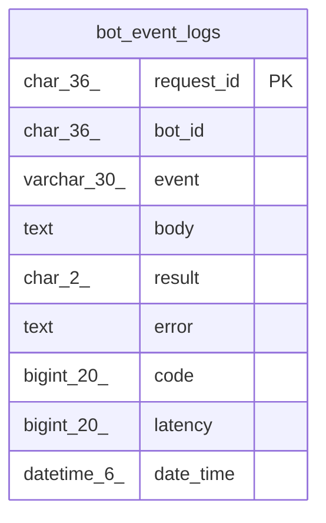

# bot_event_logs

## Description

BOTイベントログテーブル

<details>
<summary><strong>Table Definition</strong></summary>

```sql
CREATE TABLE `bot_event_logs` (
  `request_id` char(36) NOT NULL,
  `bot_id` char(36) NOT NULL,
  `event` varchar(30) NOT NULL,
  `body` text DEFAULT NULL,
  `result` char(2) NOT NULL,
  `error` text DEFAULT NULL,
  `code` bigint(20) NOT NULL DEFAULT 0,
  `latency` bigint(20) NOT NULL DEFAULT 0,
  `date_time` datetime(6) DEFAULT NULL,
  PRIMARY KEY (`request_id`),
  KEY `bot_id_date_time_idx` (`bot_id`,`date_time`)
) ENGINE=InnoDB DEFAULT CHARSET=utf8mb4
```

</details>

## Columns

| Name | Type | Default | Nullable | Children | Parents | Comment |
| ---- | ---- | ------- | -------- | -------- | ------- | ------- |
| request_id | char(36) |  | false |  |  | リクエストID |
| bot_id | char(36) |  | false |  |  | BOT UUID |
| event | varchar(30) |  | false |  |  | イベント名 |
| body | text | NULL | true |  |  | イベント内容(jsonテキストが格納) |
| result | char(2) |  | false |  |  | イベント配送結果 |
| error | text | NULL | true |  |  | エラー内容 |
| code | bigint(20) | 0 | false |  |  | HTTP Modeの場合HTTPステータスコード |
| latency | bigint(20) | 0 | false |  |  | リクエスト時間 |
| date_time | datetime(6) | NULL | true |  |  | イベント発生日時 |

## Constraints

| Name | Type | Definition |
| ---- | ---- | ---------- |
| PRIMARY | PRIMARY KEY | PRIMARY KEY (request_id) |

## Indexes

| Name | Definition |
| ---- | ---------- |
| bot_id_date_time_idx | KEY bot_id_date_time_idx (bot_id, date_time) USING BTREE |
| PRIMARY | PRIMARY KEY (request_id) USING BTREE |

## Relations



---

> Generated by [tbls](https://github.com/k1LoW/tbls)
