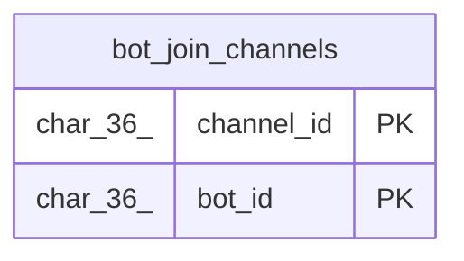

# bot_join_channels

## Description

BOT参加チャンネルテーブル

<details>
<summary><strong>Table Definition</strong></summary>

```sql
CREATE TABLE `bot_join_channels` (
  `channel_id` char(36) NOT NULL,
  `bot_id` char(36) NOT NULL,
  PRIMARY KEY (`channel_id`,`bot_id`)
) ENGINE=InnoDB DEFAULT CHARSET=utf8mb4
```

</details>

## Columns

| Name | Type | Default | Nullable | Children | Parents | Comment |
| ---- | ---- | ------- | -------- | -------- | ------- | ------- |
| channel_id | char(36) |  | false |  |  | チャンネルUUID |
| bot_id | char(36) |  | false |  |  | BOT UUID |

## Constraints

| Name | Type | Definition |
| ---- | ---- | ---------- |
| PRIMARY | PRIMARY KEY | PRIMARY KEY (channel_id, bot_id) |

## Indexes

| Name | Definition |
| ---- | ---------- |
| PRIMARY | PRIMARY KEY (channel_id, bot_id) USING BTREE |

## Relations



---

> Generated by [tbls](https://github.com/k1LoW/tbls)
