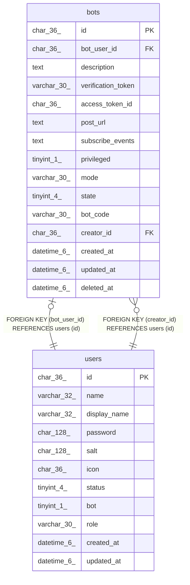

# bots

## Description

traQ BOTテーブル

<details>
<summary><strong>Table Definition</strong></summary>

```sql
CREATE TABLE `bots` (
  `id` char(36) NOT NULL,
  `bot_user_id` char(36) NOT NULL,
  `description` text NOT NULL,
  `verification_token` varchar(30) NOT NULL,
  `access_token_id` char(36) NOT NULL,
  `post_url` text NOT NULL,
  `subscribe_events` text NOT NULL,
  `privileged` tinyint(1) NOT NULL DEFAULT 0,
  `mode` varchar(30) NOT NULL,
  `state` tinyint(4) NOT NULL DEFAULT 0,
  `bot_code` varchar(30) NOT NULL,
  `creator_id` char(36) NOT NULL,
  `created_at` datetime(6) DEFAULT NULL,
  `updated_at` datetime(6) DEFAULT NULL,
  `deleted_at` datetime(6) DEFAULT NULL,
  PRIMARY KEY (`id`),
  UNIQUE KEY `uni_bots_bot_user_id` (`bot_user_id`),
  UNIQUE KEY `uni_bots_bot_code` (`bot_code`),
  KEY `bots_creator_id_users_id_foreign` (`creator_id`),
  CONSTRAINT `bots_bot_user_id_users_id_foreign` FOREIGN KEY (`bot_user_id`) REFERENCES `users` (`id`) ON DELETE CASCADE ON UPDATE CASCADE,
  CONSTRAINT `bots_creator_id_users_id_foreign` FOREIGN KEY (`creator_id`) REFERENCES `users` (`id`) ON DELETE CASCADE ON UPDATE CASCADE
) ENGINE=InnoDB DEFAULT CHARSET=utf8mb4
```

</details>

## Columns

| Name | Type | Default | Nullable | Children | Parents | Comment |
| ---- | ---- | ------- | -------- | -------- | ------- | ------- |
| id | char(36) |  | false |  |  |  |
| bot_user_id | char(36) |  | false |  | [users](users.md) | BOTユーザーUUID |
| description | text |  | false |  |  | BOT説明 |
| verification_token | varchar(30) |  | false |  |  | 認証トークン |
| access_token_id | char(36) |  | false |  |  | BOTアクセストークンID |
| post_url | text |  | false |  |  | BOTサーバーエンドポイント(HTTP Mode) |
| subscribe_events | text |  | false |  |  | BOTが購読しているイベントリスト(スペース区切り) |
| privileged | tinyint(1) | 0 | false |  |  | 特権BOTかどうか |
| mode | varchar(30) |  | false |  |  | BOT動作モード |
| state | tinyint(4) | 0 | false |  |  | BOTの状態 |
| bot_code | varchar(30) |  | false |  |  | BOTコード |
| creator_id | char(36) |  | false |  | [users](users.md) | BOT制作者UUID |
| created_at | datetime(6) | NULL | true |  |  |  |
| updated_at | datetime(6) | NULL | true |  |  |  |
| deleted_at | datetime(6) | NULL | true |  |  |  |

## Constraints

| Name | Type | Definition |
| ---- | ---- | ---------- |
| bots_bot_user_id_users_id_foreign | FOREIGN KEY | FOREIGN KEY (bot_user_id) REFERENCES users (id) |
| bots_creator_id_users_id_foreign | FOREIGN KEY | FOREIGN KEY (creator_id) REFERENCES users (id) |
| PRIMARY | PRIMARY KEY | PRIMARY KEY (id) |
| uni_bots_bot_code | UNIQUE | UNIQUE KEY uni_bots_bot_code (bot_code) |
| uni_bots_bot_user_id | UNIQUE | UNIQUE KEY uni_bots_bot_user_id (bot_user_id) |

## Indexes

| Name | Definition |
| ---- | ---------- |
| bots_creator_id_users_id_foreign | KEY bots_creator_id_users_id_foreign (creator_id) USING BTREE |
| PRIMARY | PRIMARY KEY (id) USING BTREE |
| uni_bots_bot_code | UNIQUE KEY uni_bots_bot_code (bot_code) USING BTREE |
| uni_bots_bot_user_id | UNIQUE KEY uni_bots_bot_user_id (bot_user_id) USING BTREE |

## Relations



---

> Generated by [tbls](https://github.com/k1LoW/tbls)
