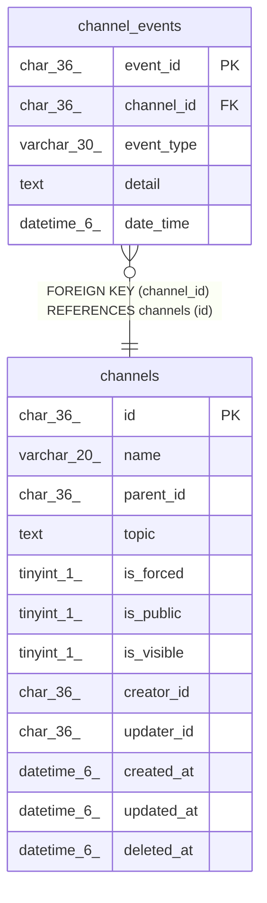

# channel_events

## Description

チャンネルイベントテーブル

<details>
<summary><strong>Table Definition</strong></summary>

```sql
CREATE TABLE `channel_events` (
  `event_id` char(36) NOT NULL,
  `channel_id` char(36) NOT NULL,
  `event_type` varchar(30) NOT NULL,
  `detail` text CHARACTER SET utf8mb4 COLLATE utf8mb4_bin NOT NULL,
  `date_time` datetime(6) DEFAULT NULL,
  PRIMARY KEY (`event_id`),
  KEY `idx_channel_events_channel_id_date_time` (`channel_id`,`date_time`),
  KEY `idx_channel_events_channel_id_event_type_date_time` (`channel_id`,`event_type`,`date_time`),
  CONSTRAINT `channel_events_channel_id_channels_id_foreign` FOREIGN KEY (`channel_id`) REFERENCES `channels` (`id`) ON DELETE CASCADE ON UPDATE CASCADE
) ENGINE=InnoDB DEFAULT CHARSET=utf8mb4
```

</details>

## Columns

| Name | Type | Default | Nullable | Children | Parents | Comment |
| ---- | ---- | ------- | -------- | -------- | ------- | ------- |
| event_id | char(36) |  | false |  |  | イベントID |
| channel_id | char(36) |  | false |  | [channels](channels.md) | チャンネルUUID |
| event_type | varchar(30) |  | false |  |  | イベントタイプ |
| detail | text |  | false |  |  | イベント詳細(jsonテキストが格納) |
| date_time | datetime(6) | NULL | true |  |  | イベント発生日時 |

## Constraints

| Name | Type | Definition |
| ---- | ---- | ---------- |
| channel_events_channel_id_channels_id_foreign | FOREIGN KEY | FOREIGN KEY (channel_id) REFERENCES channels (id) |
| PRIMARY | PRIMARY KEY | PRIMARY KEY (event_id) |

## Indexes

| Name | Definition |
| ---- | ---------- |
| idx_channel_events_channel_id_date_time | KEY idx_channel_events_channel_id_date_time (channel_id, date_time) USING BTREE |
| idx_channel_events_channel_id_event_type_date_time | KEY idx_channel_events_channel_id_event_type_date_time (channel_id, event_type, date_time) USING BTREE |
| PRIMARY | PRIMARY KEY (event_id) USING BTREE |

## Relations



---

> Generated by [tbls](https://github.com/k1LoW/tbls)
