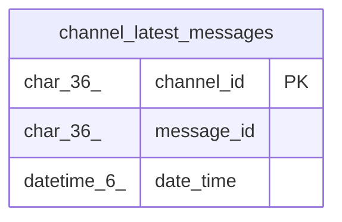

# channel_latest_messages

## Description

チャンネル最新メッセージテーブル

<details>
<summary><strong>Table Definition</strong></summary>

```sql
CREATE TABLE `channel_latest_messages` (
  `channel_id` char(36) NOT NULL,
  `message_id` char(36) NOT NULL,
  `date_time` datetime(6) DEFAULT NULL,
  PRIMARY KEY (`channel_id`),
  KEY `idx_channel_latest_messages_date_time` (`date_time`)
) ENGINE=InnoDB DEFAULT CHARSET=utf8mb4
```

</details>

## Columns

| Name | Type | Default | Nullable | Children | Parents | Comment |
| ---- | ---- | ------- | -------- | -------- | ------- | ------- |
| channel_id | char(36) |  | false |  |  | チャンネルUUID |
| message_id | char(36) |  | false |  |  | メッセージUUID |
| date_time | datetime(6) | NULL | true |  |  | メッセージ作成日時 |

## Constraints

| Name | Type | Definition |
| ---- | ---- | ---------- |
| PRIMARY | PRIMARY KEY | PRIMARY KEY (channel_id) |

## Indexes

| Name | Definition |
| ---- | ---------- |
| idx_channel_latest_messages_date_time | KEY idx_channel_latest_messages_date_time (date_time) USING BTREE |
| PRIMARY | PRIMARY KEY (channel_id) USING BTREE |

## Relations



---

> Generated by [tbls](https://github.com/k1LoW/tbls)
