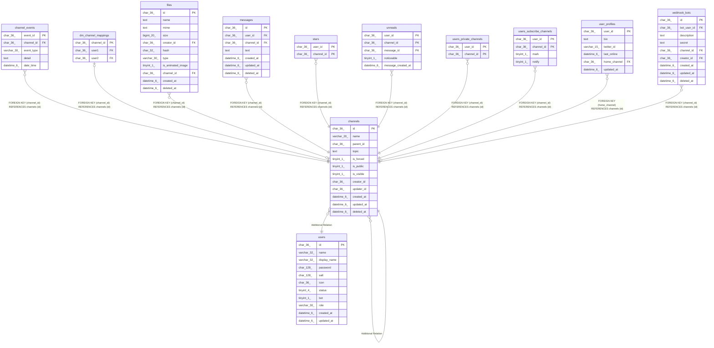

# channels

## Description

チャンネルテーブル

<details>
<summary><strong>Table Definition</strong></summary>

```sql
CREATE TABLE `channels` (
  `id` char(36) NOT NULL,
  `name` varchar(20) NOT NULL,
  `parent_id` char(36) NOT NULL,
  `topic` text CHARACTER SET utf8mb4 COLLATE utf8mb4_bin NOT NULL,
  `is_forced` tinyint(1) NOT NULL DEFAULT 0,
  `is_public` tinyint(1) NOT NULL DEFAULT 0,
  `is_visible` tinyint(1) NOT NULL DEFAULT 0,
  `creator_id` char(36) NOT NULL,
  `updater_id` char(36) NOT NULL,
  `created_at` datetime(6) DEFAULT NULL,
  `updated_at` datetime(6) DEFAULT NULL,
  `deleted_at` datetime(6) DEFAULT NULL,
  PRIMARY KEY (`id`),
  UNIQUE KEY `name_parent` (`name`,`parent_id`),
  KEY `idx_channel_channels_id_is_public_is_forced` (`id`,`is_public`,`is_forced`)
) ENGINE=InnoDB DEFAULT CHARSET=utf8mb4
```

</details>

## Columns

| Name | Type | Default | Nullable | Children | Parents | Comment |
| ---- | ---- | ------- | -------- | -------- | ------- | ------- |
| id | char(36) |  | false | [channel_events](channel_events.md) [dm_channel_mappings](dm_channel_mappings.md) [files](files.md) [messages](messages.md) [stars](stars.md) [unreads](unreads.md) [users_private_channels](users_private_channels.md) [users_subscribe_channels](users_subscribe_channels.md) [user_profiles](user_profiles.md) [webhook_bots](webhook_bots.md) [channels](channels.md) |  | チャンネルUUID |
| name | varchar(20) |  | false |  |  | チャンネル名 |
| parent_id | char(36) |  | false |  | [channels](channels.md) | 親チャンネルUUID |
| topic | text |  | false |  |  | チャンネルトピック |
| is_forced | tinyint(1) | 0 | false |  |  | 強制通知チャンネルかどうか |
| is_public | tinyint(1) | 0 | false |  |  | 公開チャンネルかどうか |
| is_visible | tinyint(1) | 0 | false |  |  | 可視チャンネルかどうか |
| creator_id | char(36) |  | false |  | [users](users.md) | チャンネル作成者UUID |
| updater_id | char(36) |  | false |  | [users](users.md) | チャンネル更新者UUID |
| created_at | datetime(6) | NULL | true |  |  | チャンネル作成日時 |
| updated_at | datetime(6) | NULL | true |  |  | チャンネル更新日時 |
| deleted_at | datetime(6) | NULL | true |  |  | チャンネル削除日時 |

## Constraints

| Name | Type | Definition |
| ---- | ---- | ---------- |
| name_parent | UNIQUE | UNIQUE KEY name_parent (name, parent_id) |
| PRIMARY | PRIMARY KEY | PRIMARY KEY (id) |

## Indexes

| Name | Definition |
| ---- | ---------- |
| idx_channel_channels_id_is_public_is_forced | KEY idx_channel_channels_id_is_public_is_forced (id, is_public, is_forced) USING BTREE |
| PRIMARY | PRIMARY KEY (id) USING BTREE |
| name_parent | UNIQUE KEY name_parent (name, parent_id) USING BTREE |

## Relations



---

> Generated by [tbls](https://github.com/k1LoW/tbls)
