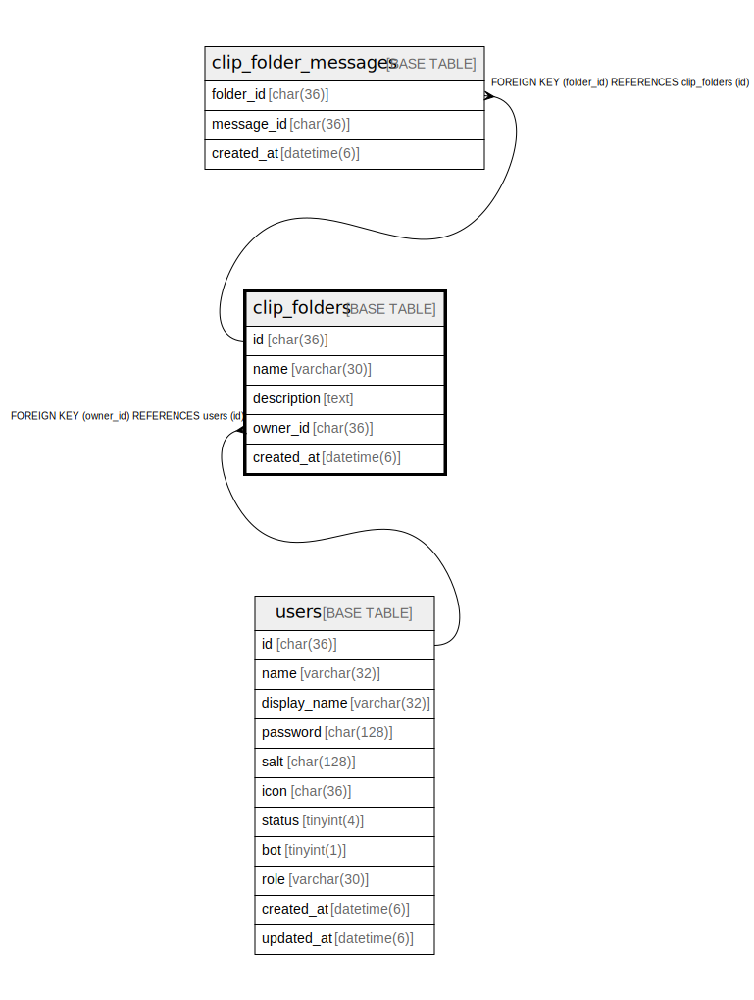

# clip_folders

## Description

クリップフォルダーテーブル

<details>
<summary><strong>Table Definition</strong></summary>

```sql
CREATE TABLE `clip_folders` (
  `id` char(36) NOT NULL,
  `name` varchar(30) NOT NULL,
  `description` text NOT NULL,
  `owner_id` char(36) NOT NULL,
  `created_at` datetime(6) DEFAULT NULL,
  PRIMARY KEY (`id`),
  KEY `idx_clip_folders_owner_id` (`owner_id`),
  CONSTRAINT `clip_folders_owner_id_users_id_foreign` FOREIGN KEY (`owner_id`) REFERENCES `users` (`id`) ON DELETE CASCADE ON UPDATE CASCADE
) ENGINE=InnoDB DEFAULT CHARSET=utf8mb4
```

</details>

## Columns

| Name | Type | Default | Nullable | Children | Parents | Comment |
| ---- | ---- | ------- | -------- | -------- | ------- | ------- |
| id | char(36) |  | false | [clip_folder_messages](clip_folder_messages.md) |  | クリップフォルダーID |
| name | varchar(30) |  | false |  |  | クリップフォルダー名 |
| description | text |  | false |  |  | 説明 |
| owner_id | char(36) |  | false |  | [users](users.md) | 所有者のUUID |
| created_at | datetime(6) | NULL | true |  |  | 作成日時 |

## Constraints

| Name | Type | Definition |
| ---- | ---- | ---------- |
| clip_folders_owner_id_users_id_foreign | FOREIGN KEY | FOREIGN KEY (owner_id) REFERENCES users (id) |
| PRIMARY | PRIMARY KEY | PRIMARY KEY (id) |

## Indexes

| Name | Definition |
| ---- | ---------- |
| idx_clip_folders_owner_id | KEY idx_clip_folders_owner_id (owner_id) USING BTREE |
| PRIMARY | PRIMARY KEY (id) USING BTREE |

## Relations



---

> Generated by [tbls](https://github.com/k1LoW/tbls)
