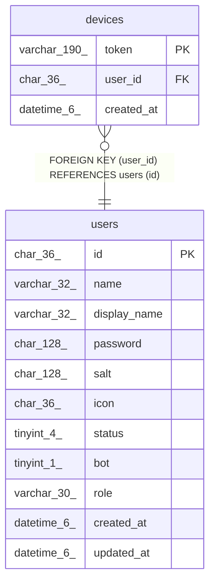

# devices

## Description

FCMデバイステーブル

<details>
<summary><strong>Table Definition</strong></summary>

```sql
CREATE TABLE `devices` (
  `token` varchar(190) NOT NULL,
  `user_id` char(36) NOT NULL,
  `created_at` datetime(6) DEFAULT NULL,
  PRIMARY KEY (`token`),
  KEY `idx_devices_user_id` (`user_id`),
  CONSTRAINT `devices_user_id_users_id_foreign` FOREIGN KEY (`user_id`) REFERENCES `users` (`id`) ON DELETE CASCADE ON UPDATE CASCADE
) ENGINE=InnoDB DEFAULT CHARSET=utf8mb4
```

</details>

## Columns

| Name | Type | Default | Nullable | Children | Parents | Comment |
| ---- | ---- | ------- | -------- | -------- | ------- | ------- |
| token | varchar(190) |  | false |  |  | FCMデバイストークン |
| user_id | char(36) |  | false |  | [users](users.md) | ユーザーUUID |
| created_at | datetime(6) | NULL | true |  |  | 作成日時 |

## Constraints

| Name | Type | Definition |
| ---- | ---- | ---------- |
| devices_user_id_users_id_foreign | FOREIGN KEY | FOREIGN KEY (user_id) REFERENCES users (id) |
| PRIMARY | PRIMARY KEY | PRIMARY KEY (token) |

## Indexes

| Name | Definition |
| ---- | ---------- |
| idx_devices_user_id | KEY idx_devices_user_id (user_id) USING BTREE |
| PRIMARY | PRIMARY KEY (token) USING BTREE |

## Relations



---

> Generated by [tbls](https://github.com/k1LoW/tbls)
