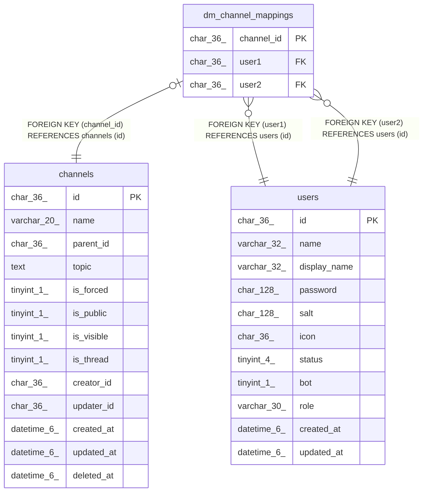

# dm_channel_mappings

## Description

DMチャンネルマッピングテーブル

<details>
<summary><strong>Table Definition</strong></summary>

```sql
CREATE TABLE `dm_channel_mappings` (
  `channel_id` char(36) NOT NULL,
  `user1` char(36) NOT NULL,
  `user2` char(36) NOT NULL,
  PRIMARY KEY (`channel_id`),
  UNIQUE KEY `user1_user2` (`user1`,`user2`),
  KEY `dm_channel_mappings_user_two_users_id_foreign` (`user2`),
  CONSTRAINT `dm_channel_mappings_channel_id_channels_id_foreign` FOREIGN KEY (`channel_id`) REFERENCES `channels` (`id`) ON DELETE CASCADE ON UPDATE CASCADE,
  CONSTRAINT `dm_channel_mappings_user_one_users_id_foreign` FOREIGN KEY (`user1`) REFERENCES `users` (`id`) ON DELETE CASCADE ON UPDATE CASCADE,
  CONSTRAINT `dm_channel_mappings_user_two_users_id_foreign` FOREIGN KEY (`user2`) REFERENCES `users` (`id`) ON DELETE CASCADE ON UPDATE CASCADE
) ENGINE=InnoDB DEFAULT CHARSET=utf8mb4
```

</details>

## Columns

| Name | Type | Default | Nullable | Children | Parents | Comment |
| ---- | ---- | ------- | -------- | -------- | ------- | ------- |
| channel_id | char(36) |  | false |  | [channels](channels.md) | チャンネルUUID |
| user1 | char(36) |  | false |  | [users](users.md) | ユーザーUUID |
| user2 | char(36) |  | false |  | [users](users.md) | ユーザーUUID |

## Constraints

| Name | Type | Definition |
| ---- | ---- | ---------- |
| dm_channel_mappings_channel_id_channels_id_foreign | FOREIGN KEY | FOREIGN KEY (channel_id) REFERENCES channels (id) |
| dm_channel_mappings_user_one_users_id_foreign | FOREIGN KEY | FOREIGN KEY (user1) REFERENCES users (id) |
| dm_channel_mappings_user_two_users_id_foreign | FOREIGN KEY | FOREIGN KEY (user2) REFERENCES users (id) |
| PRIMARY | PRIMARY KEY | PRIMARY KEY (channel_id) |
| user1_user2 | UNIQUE | UNIQUE KEY user1_user2 (user1, user2) |

## Indexes

| Name | Definition |
| ---- | ---------- |
| dm_channel_mappings_user_two_users_id_foreign | KEY dm_channel_mappings_user_two_users_id_foreign (user2) USING BTREE |
| PRIMARY | PRIMARY KEY (channel_id) USING BTREE |
| user1_user2 | UNIQUE KEY user1_user2 (user1, user2) USING BTREE |

## Relations



---

> Generated by [tbls](https://github.com/k1LoW/tbls)
