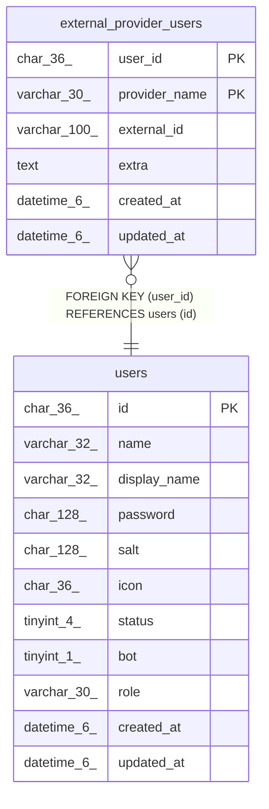

# external_provider_users

## Description

外部認証ユーザーテーブル

<details>
<summary><strong>Table Definition</strong></summary>

```sql
CREATE TABLE `external_provider_users` (
  `user_id` char(36) NOT NULL,
  `provider_name` varchar(30) NOT NULL,
  `external_id` varchar(100) NOT NULL,
  `extra` text NOT NULL,
  `created_at` datetime(6) DEFAULT NULL,
  `updated_at` datetime(6) DEFAULT NULL,
  PRIMARY KEY (`user_id`,`provider_name`),
  UNIQUE KEY `idx_external_provider_users_provider_name_external_id` (`provider_name`,`external_id`),
  CONSTRAINT `external_provider_users_user_id_users_id_foreign` FOREIGN KEY (`user_id`) REFERENCES `users` (`id`) ON DELETE CASCADE ON UPDATE CASCADE
) ENGINE=InnoDB DEFAULT CHARSET=utf8mb4
```

</details>

## Columns

| Name | Type | Default | Nullable | Children | Parents | Comment |
| ---- | ---- | ------- | -------- | -------- | ------- | ------- |
| user_id | char(36) |  | false |  | [users](users.md) | ユーザーUUID |
| provider_name | varchar(30) |  | false |  |  | 認証プロバイダ名 |
| external_id | varchar(100) |  | false |  |  | 認証プロバイダ上でのID |
| extra | text |  | false |  |  | 追加データ |
| created_at | datetime(6) | NULL | true |  |  |  |
| updated_at | datetime(6) | NULL | true |  |  |  |

## Constraints

| Name | Type | Definition |
| ---- | ---- | ---------- |
| external_provider_users_user_id_users_id_foreign | FOREIGN KEY | FOREIGN KEY (user_id) REFERENCES users (id) |
| idx_external_provider_users_provider_name_external_id | UNIQUE | UNIQUE KEY idx_external_provider_users_provider_name_external_id (provider_name, external_id) |
| PRIMARY | PRIMARY KEY | PRIMARY KEY (user_id, provider_name) |

## Indexes

| Name | Definition |
| ---- | ---------- |
| PRIMARY | PRIMARY KEY (user_id, provider_name) USING BTREE |
| idx_external_provider_users_provider_name_external_id | UNIQUE KEY idx_external_provider_users_provider_name_external_id (provider_name, external_id) USING BTREE |

## Relations



---

> Generated by [tbls](https://github.com/k1LoW/tbls)
