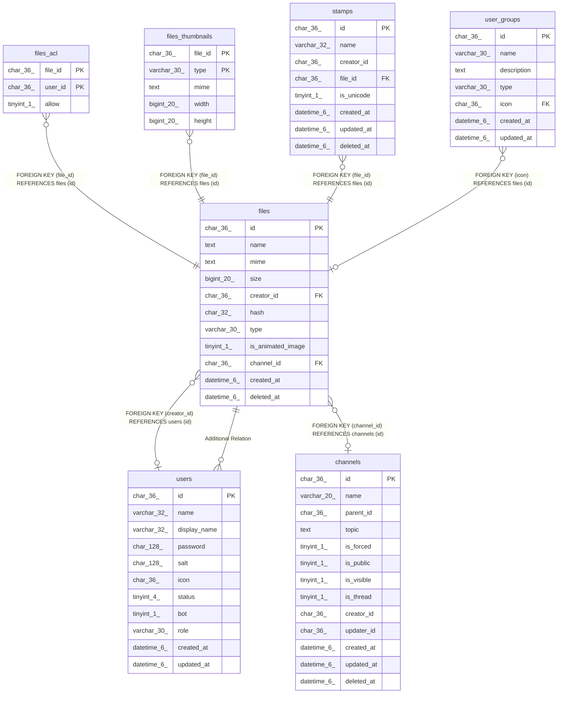

# files

## Description

ファイルテーブル

<details>
<summary><strong>Table Definition</strong></summary>

```sql
CREATE TABLE `files` (
  `id` char(36) NOT NULL,
  `name` text NOT NULL,
  `mime` text NOT NULL,
  `size` bigint(20) NOT NULL,
  `creator_id` char(36) DEFAULT NULL,
  `hash` char(32) NOT NULL,
  `type` varchar(30) NOT NULL,
  `is_animated_image` tinyint(1) NOT NULL DEFAULT 0,
  `channel_id` char(36) DEFAULT NULL,
  `created_at` datetime(6) DEFAULT NULL,
  `deleted_at` datetime(6) DEFAULT NULL,
  PRIMARY KEY (`id`),
  KEY `idx_files_creator_id_created_at` (`creator_id`,`created_at`),
  KEY `idx_files_channel_id_created_at` (`channel_id`,`created_at`),
  CONSTRAINT `files_channel_id_channels_id_foreign` FOREIGN KEY (`channel_id`) REFERENCES `channels` (`id`) ON DELETE SET NULL ON UPDATE CASCADE,
  CONSTRAINT `files_creator_id_users_id_foreign` FOREIGN KEY (`creator_id`) REFERENCES `users` (`id`) ON UPDATE CASCADE
) ENGINE=InnoDB DEFAULT CHARSET=utf8mb4
```

</details>

## Columns

| Name | Type | Default | Nullable | Children | Parents | Comment |
| ---- | ---- | ------- | -------- | -------- | ------- | ------- |
| id | char(36) |  | false | [files_acl](files_acl.md) [files_thumbnails](files_thumbnails.md) [stamps](stamps.md) [user_groups](user_groups.md) [users](users.md) |  |  |
| name | text |  | false |  |  | ファイル名 |
| mime | text |  | false |  |  | ファイルMIMEタイプ |
| size | bigint(20) |  | false |  |  | ファイルサイズ(byte) |
| creator_id | char(36) | NULL | true |  | [users](users.md) | ファイル作成者UUID |
| hash | char(32) |  | false |  |  | MD5ハッシュ |
| type | varchar(30) |  | false |  |  | ファイルタイプ |
| is_animated_image | tinyint(1) | 0 | false |  |  | アニメーション画像かどうか |
| channel_id | char(36) | NULL | true |  | [channels](channels.md) | 所属チャンネルUUID |
| created_at | datetime(6) | NULL | true |  |  |  |
| deleted_at | datetime(6) | NULL | true |  |  |  |

## Constraints

| Name | Type | Definition |
| ---- | ---- | ---------- |
| files_channel_id_channels_id_foreign | FOREIGN KEY | FOREIGN KEY (channel_id) REFERENCES channels (id) |
| files_creator_id_users_id_foreign | FOREIGN KEY | FOREIGN KEY (creator_id) REFERENCES users (id) |
| PRIMARY | PRIMARY KEY | PRIMARY KEY (id) |

## Indexes

| Name | Definition |
| ---- | ---------- |
| idx_files_channel_id_created_at | KEY idx_files_channel_id_created_at (channel_id, created_at) USING BTREE |
| idx_files_creator_id_created_at | KEY idx_files_creator_id_created_at (creator_id, created_at) USING BTREE |
| PRIMARY | PRIMARY KEY (id) USING BTREE |

## Relations



---

> Generated by [tbls](https://github.com/k1LoW/tbls)
