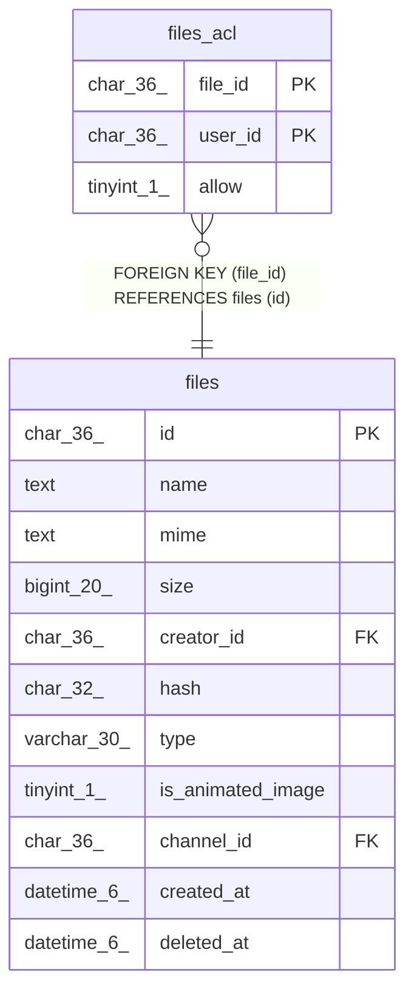

# files_acl

## Description

ファイルアクセスコントロールリストテーブル

<details>
<summary><strong>Table Definition</strong></summary>

```sql
CREATE TABLE `files_acl` (
  `file_id` char(36) NOT NULL,
  `user_id` char(36) NOT NULL,
  `allow` tinyint(1) NOT NULL,
  PRIMARY KEY (`file_id`,`user_id`),
  CONSTRAINT `files_acl_file_id_files_id_foreign` FOREIGN KEY (`file_id`) REFERENCES `files` (`id`) ON DELETE CASCADE ON UPDATE CASCADE
) ENGINE=InnoDB DEFAULT CHARSET=utf8mb4
```

</details>

## Columns

| Name | Type | Default | Nullable | Children | Parents | Comment |
| ---- | ---- | ------- | -------- | -------- | ------- | ------- |
| file_id | char(36) |  | false |  | [files](files.md) | ファイルUUID |
| user_id | char(36) |  | false |  |  | ユーザーUUID |
| allow | tinyint(1) |  | false |  |  | 許可 |

## Constraints

| Name | Type | Definition |
| ---- | ---- | ---------- |
| files_acl_file_id_files_id_foreign | FOREIGN KEY | FOREIGN KEY (file_id) REFERENCES files (id) |
| PRIMARY | PRIMARY KEY | PRIMARY KEY (file_id, user_id) |

## Indexes

| Name | Definition |
| ---- | ---------- |
| PRIMARY | PRIMARY KEY (file_id, user_id) USING BTREE |

## Relations



---

> Generated by [tbls](https://github.com/k1LoW/tbls)
