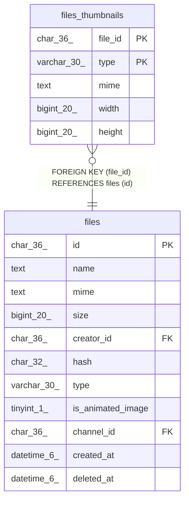

# files_thumbnails

## Description

ファイルサムネイルテーブル

<details>
<summary><strong>Table Definition</strong></summary>

```sql
CREATE TABLE `files_thumbnails` (
  `file_id` char(36) NOT NULL,
  `type` varchar(30) NOT NULL,
  `mime` text NOT NULL,
  `width` bigint(20) NOT NULL DEFAULT 0,
  `height` bigint(20) NOT NULL DEFAULT 0,
  PRIMARY KEY (`file_id`,`type`),
  CONSTRAINT `files_thumbnails_file_id_files_id_foreign` FOREIGN KEY (`file_id`) REFERENCES `files` (`id`) ON DELETE CASCADE ON UPDATE CASCADE
) ENGINE=InnoDB DEFAULT CHARSET=utf8mb4
```

</details>

## Columns

| Name | Type | Default | Nullable | Children | Parents | Comment |
| ---- | ---- | ------- | -------- | -------- | ------- | ------- |
| file_id | char(36) |  | false |  | [files](files.md) | ファイルUUID |
| type | varchar(30) |  | false |  |  | サムネイルタイプ |
| mime | text |  | false |  |  | MIMEタイプ |
| width | bigint(20) | 0 | false |  |  | 画像の幅 |
| height | bigint(20) | 0 | false |  |  | 画像の高さ |

## Constraints

| Name | Type | Definition |
| ---- | ---- | ---------- |
| files_thumbnails_file_id_files_id_foreign | FOREIGN KEY | FOREIGN KEY (file_id) REFERENCES files (id) |
| PRIMARY | PRIMARY KEY | PRIMARY KEY (file_id, type) |

## Indexes

| Name | Definition |
| ---- | ---------- |
| PRIMARY | PRIMARY KEY (file_id, type) USING BTREE |

## Relations



---

> Generated by [tbls](https://github.com/k1LoW/tbls)
