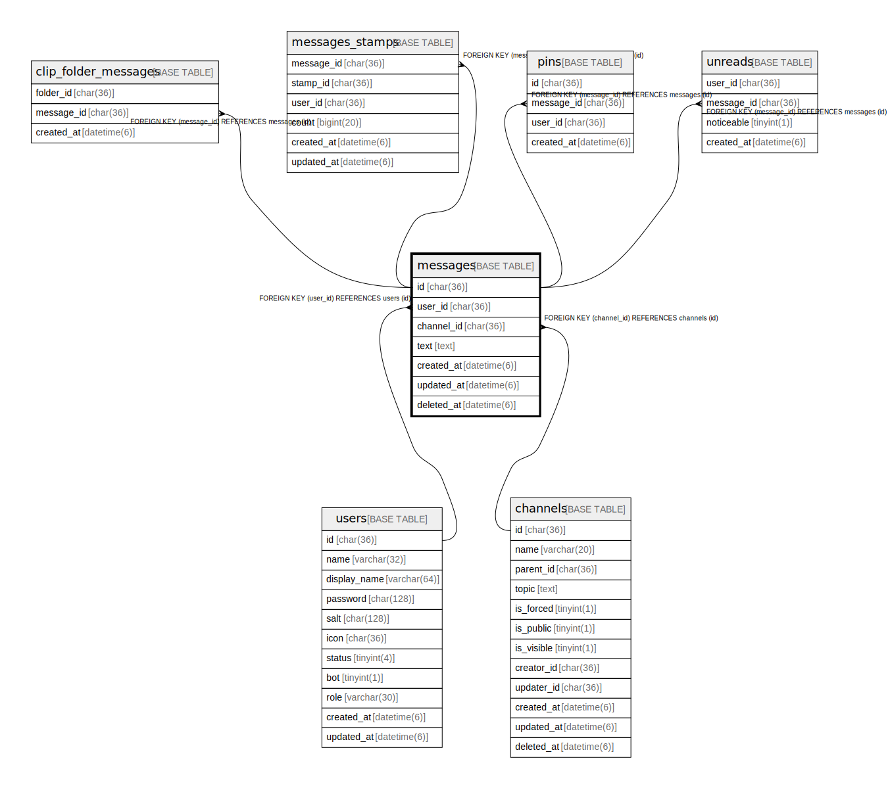

# messages

## Description

メッセージテーブル

<details>
<summary><strong>Table Definition</strong></summary>

```sql
CREATE TABLE `messages` (
  `id` char(36) NOT NULL,
  `user_id` char(36) NOT NULL,
  `channel_id` char(36) NOT NULL,
  `text` text CHARACTER SET utf8mb4 COLLATE utf8mb4_bin NOT NULL,
  `created_at` datetime(6) DEFAULT NULL,
  `updated_at` datetime(6) DEFAULT NULL,
  `deleted_at` datetime(6) DEFAULT NULL,
  PRIMARY KEY (`id`),
  KEY `idx_messages_deleted_at_updated_at` (`deleted_at`,`updated_at`),
  KEY `idx_messages_channel_id_deleted_at_created_at` (`channel_id`,`deleted_at`,`created_at`),
  KEY `idx_messages_created_at` (`created_at`),
  KEY `idx_messages_deleted_at_created_at` (`deleted_at`,`created_at`),
  KEY `messages_user_id_users_id_foreign` (`user_id`),
  CONSTRAINT `messages_channel_id_channels_id_foreign` FOREIGN KEY (`channel_id`) REFERENCES `channels` (`id`) ON DELETE CASCADE ON UPDATE CASCADE,
  CONSTRAINT `messages_user_id_users_id_foreign` FOREIGN KEY (`user_id`) REFERENCES `users` (`id`) ON DELETE CASCADE ON UPDATE CASCADE
) ENGINE=InnoDB DEFAULT CHARSET=utf8mb4
```

</details>

## Columns

| Name | Type | Default | Nullable | Children | Parents | Comment |
| ---- | ---- | ------- | -------- | -------- | ------- | ------- |
| id | char(36) |  | false | [clip_folder_messages](clip_folder_messages.md) [messages_stamps](messages_stamps.md) [pins](pins.md) [unreads](unreads.md) |  | メッセージUUID |
| user_id | char(36) |  | false |  | [users](users.md) | 投稿ユーザーUUID |
| channel_id | char(36) |  | false |  | [channels](channels.md) | 投稿先チャンネルUUID |
| text | text |  | false |  |  | 本文 |
| created_at | datetime(6) | NULL | true |  |  | 作成日時 |
| updated_at | datetime(6) | NULL | true |  |  | 更新日時 |
| deleted_at | datetime(6) | NULL | true |  |  | 削除日時 |

## Constraints

| Name | Type | Definition |
| ---- | ---- | ---------- |
| messages_channel_id_channels_id_foreign | FOREIGN KEY | FOREIGN KEY (channel_id) REFERENCES channels (id) |
| messages_user_id_users_id_foreign | FOREIGN KEY | FOREIGN KEY (user_id) REFERENCES users (id) |
| PRIMARY | PRIMARY KEY | PRIMARY KEY (id) |

## Indexes

| Name | Definition |
| ---- | ---------- |
| idx_messages_channel_id_deleted_at_created_at | KEY idx_messages_channel_id_deleted_at_created_at (channel_id, deleted_at, created_at) USING BTREE |
| idx_messages_created_at | KEY idx_messages_created_at (created_at) USING BTREE |
| idx_messages_deleted_at_created_at | KEY idx_messages_deleted_at_created_at (deleted_at, created_at) USING BTREE |
| idx_messages_deleted_at_updated_at | KEY idx_messages_deleted_at_updated_at (deleted_at, updated_at) USING BTREE |
| messages_user_id_users_id_foreign | KEY messages_user_id_users_id_foreign (user_id) USING BTREE |
| PRIMARY | PRIMARY KEY (id) USING BTREE |

## Relations



---

> Generated by [tbls](https://github.com/k1LoW/tbls)
