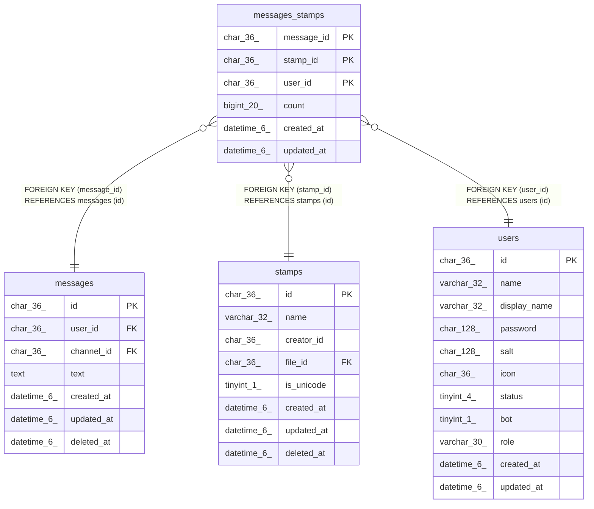

# messages_stamps

## Description

メッセージスタンプテーブル

<details>
<summary><strong>Table Definition</strong></summary>

```sql
CREATE TABLE `messages_stamps` (
  `message_id` char(36) NOT NULL,
  `stamp_id` char(36) NOT NULL,
  `user_id` char(36) NOT NULL,
  `count` bigint(20) NOT NULL,
  `created_at` datetime(6) DEFAULT NULL,
  `updated_at` datetime(6) DEFAULT NULL,
  PRIMARY KEY (`message_id`,`stamp_id`,`user_id`),
  KEY `idx_messages_stamps_message_id` (`message_id`),
  KEY `idx_messages_stamps_user_id_stamp_id_updated_at` (`user_id`,`stamp_id`,`updated_at`),
  KEY `idx_messages_stamps_user_id_updated_at` (`user_id`,`updated_at`),
  KEY `idx_messages_stamps_updated_at` (`updated_at`),
  KEY `messages_stamps_stamp_id_stamps_id_foreign` (`stamp_id`),
  CONSTRAINT `messages_stamps_message_id_messages_id_foreign` FOREIGN KEY (`message_id`) REFERENCES `messages` (`id`) ON DELETE CASCADE ON UPDATE CASCADE,
  CONSTRAINT `messages_stamps_stamp_id_stamps_id_foreign` FOREIGN KEY (`stamp_id`) REFERENCES `stamps` (`id`) ON DELETE CASCADE ON UPDATE CASCADE,
  CONSTRAINT `messages_stamps_user_id_users_id_foreign` FOREIGN KEY (`user_id`) REFERENCES `users` (`id`) ON DELETE CASCADE ON UPDATE CASCADE
) ENGINE=InnoDB DEFAULT CHARSET=utf8mb4
```

</details>

## Columns

| Name | Type | Default | Nullable | Children | Parents | Comment |
| ---- | ---- | ------- | -------- | -------- | ------- | ------- |
| message_id | char(36) |  | false |  | [messages](messages.md) | メッセージUUID |
| stamp_id | char(36) |  | false |  | [stamps](stamps.md) | スタンプUUID |
| user_id | char(36) |  | false |  | [users](users.md) | ユーザーUUID |
| count | bigint(20) |  | false |  |  | スタンプ数 |
| created_at | datetime(6) | NULL | true |  |  | 作成日時 |
| updated_at | datetime(6) | NULL | true |  |  | 更新日時 |

## Constraints

| Name | Type | Definition |
| ---- | ---- | ---------- |
| messages_stamps_message_id_messages_id_foreign | FOREIGN KEY | FOREIGN KEY (message_id) REFERENCES messages (id) |
| messages_stamps_stamp_id_stamps_id_foreign | FOREIGN KEY | FOREIGN KEY (stamp_id) REFERENCES stamps (id) |
| messages_stamps_user_id_users_id_foreign | FOREIGN KEY | FOREIGN KEY (user_id) REFERENCES users (id) |
| PRIMARY | PRIMARY KEY | PRIMARY KEY (message_id, stamp_id, user_id) |

## Indexes

| Name | Definition |
| ---- | ---------- |
| idx_messages_stamps_message_id | KEY idx_messages_stamps_message_id (message_id) USING BTREE |
| idx_messages_stamps_updated_at | KEY idx_messages_stamps_updated_at (updated_at) USING BTREE |
| idx_messages_stamps_user_id_stamp_id_updated_at | KEY idx_messages_stamps_user_id_stamp_id_updated_at (user_id, stamp_id, updated_at) USING BTREE |
| idx_messages_stamps_user_id_updated_at | KEY idx_messages_stamps_user_id_updated_at (user_id, updated_at) USING BTREE |
| messages_stamps_stamp_id_stamps_id_foreign | KEY messages_stamps_stamp_id_stamps_id_foreign (stamp_id) USING BTREE |
| PRIMARY | PRIMARY KEY (message_id, stamp_id, user_id) USING BTREE |

## Relations



---

> Generated by [tbls](https://github.com/k1LoW/tbls)
