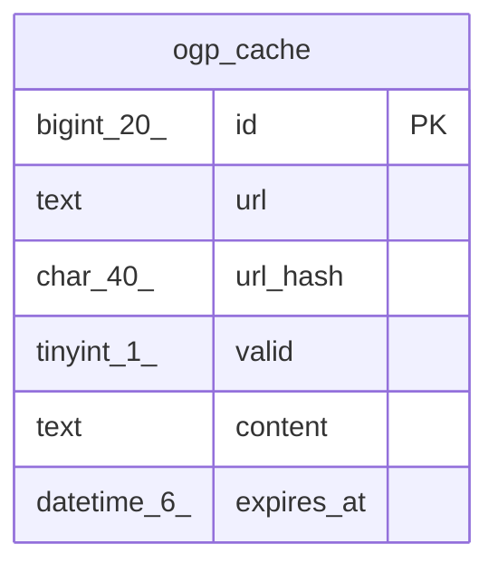

# ogp_cache

## Description

OGPキャッシュテーブル

<details>
<summary><strong>Table Definition</strong></summary>

```sql
CREATE TABLE `ogp_cache` (
  `id` bigint(20) NOT NULL AUTO_INCREMENT,
  `url` text NOT NULL,
  `url_hash` char(40) NOT NULL,
  `valid` tinyint(1) DEFAULT NULL,
  `content` text DEFAULT NULL,
  `expires_at` datetime(6) DEFAULT NULL,
  PRIMARY KEY (`id`),
  KEY `idx_ogp_cache_url_hash` (`url_hash`)
) ENGINE=InnoDB DEFAULT CHARSET=utf8mb4
```

</details>

## Columns

| Name | Type | Default | Nullable | Extra Definition | Children | Parents | Comment |
| ---- | ---- | ------- | -------- | ---------------- | -------- | ------- | ------- |
| id | bigint(20) |  | false | auto_increment |  |  |  |
| url | text |  | false |  |  |  | 対象ページのURL |
| url_hash | char(40) |  | false |  |  |  | URLのSHA-1ハッシュ |
| valid | tinyint(1) | NULL | true |  |  |  | ネガティブキャッシュでないか |
| content | text | NULL | true |  |  |  | キャッシュ内容 |
| expires_at | datetime(6) | NULL | true |  |  |  | 有効期限 |

## Constraints

| Name | Type | Definition |
| ---- | ---- | ---------- |
| PRIMARY | PRIMARY KEY | PRIMARY KEY (id) |

## Indexes

| Name | Definition |
| ---- | ---------- |
| idx_ogp_cache_url_hash | KEY idx_ogp_cache_url_hash (url_hash) USING BTREE |
| PRIMARY | PRIMARY KEY (id) USING BTREE |

## Relations



---

> Generated by [tbls](https://github.com/k1LoW/tbls)
