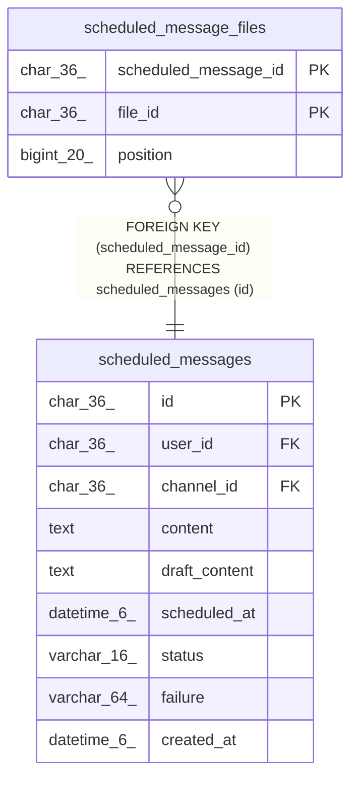

# scheduled_message_files

## Description

予約投稿の添付ファイル（各添付は一つの予約のみ使用）

<details>
<summary><strong>Table Definition</strong></summary>

```sql
CREATE TABLE `scheduled_message_files` (
  `scheduled_message_id` char(36) NOT NULL,
  `file_id` char(36) NOT NULL,
  `position` bigint(20) NOT NULL,
  PRIMARY KEY (`scheduled_message_id`,`file_id`),
  UNIQUE KEY `idx_scheduled_message_files_file_id` (`file_id`),
  CONSTRAINT `scheduled_message_files_scheduled_message_id_foreign` FOREIGN KEY (`scheduled_message_id`) REFERENCES `scheduled_messages` (`id`) ON DELETE CASCADE ON UPDATE CASCADE
) ENGINE=InnoDB DEFAULT CHARSET=utf8mb4
```

</details>

## Columns

| Name | Type | Default | Nullable | Children | Parents | Comment |
| ---- | ---- | ------- | -------- | -------- | ------- | ------- |
| scheduled_message_id | char(36) |  | false |  | [scheduled_messages](scheduled_messages.md) | 予約UUID |
| file_id | char(36) |  | false |  |  | 添付ファイルUUID |
| position | bigint(20) |  | false |  |  | 添付の表示順 |

## Constraints

| Name | Type | Definition |
| ---- | ---- | ---------- |
| idx_scheduled_message_files_file_id | UNIQUE | UNIQUE KEY idx_scheduled_message_files_file_id (file_id) |
| PRIMARY | PRIMARY KEY | PRIMARY KEY (scheduled_message_id, file_id) |
| scheduled_message_files_scheduled_message_id_foreign | FOREIGN KEY | FOREIGN KEY (scheduled_message_id) REFERENCES scheduled_messages (id) |

## Indexes

| Name | Definition |
| ---- | ---------- |
| PRIMARY | PRIMARY KEY (scheduled_message_id, file_id) USING BTREE |
| idx_scheduled_message_files_file_id | UNIQUE KEY idx_scheduled_message_files_file_id (file_id) USING BTREE |

## Relations



---

> Generated by [tbls](https://github.com/k1LoW/tbls)
