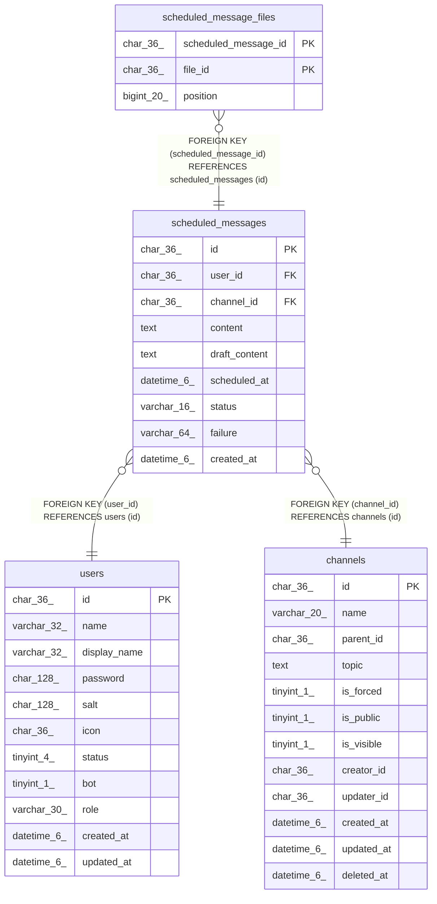

# scheduled_messages

## Description

本人限定の単発予約投稿

<details>
<summary><strong>Table Definition</strong></summary>

```sql
CREATE TABLE `scheduled_messages` (
  `id` char(36) NOT NULL,
  `user_id` char(36) NOT NULL,
  `channel_id` char(36) NOT NULL,
  `content` text CHARACTER SET utf8mb4 COLLATE utf8mb4_bin NOT NULL,
  `draft_content` text CHARACTER SET utf8mb4 COLLATE utf8mb4_bin NOT NULL,
  `scheduled_at` datetime(6) NOT NULL,
  `status` varchar(16) NOT NULL,
  `failure` varchar(64) NOT NULL,
  `created_at` datetime(6) DEFAULT NULL,
  PRIMARY KEY (`id`),
  KEY `idx_scheduled_messages_user_id` (`user_id`),
  KEY `idx_scheduled_messages_due` (`status`,`scheduled_at`),
  KEY `scheduled_messages_channel_id_channels_id_foreign` (`channel_id`),
  CONSTRAINT `scheduled_messages_channel_id_channels_id_foreign` FOREIGN KEY (`channel_id`) REFERENCES `channels` (`id`) ON DELETE CASCADE ON UPDATE CASCADE,
  CONSTRAINT `scheduled_messages_user_id_users_id_foreign` FOREIGN KEY (`user_id`) REFERENCES `users` (`id`) ON DELETE CASCADE ON UPDATE CASCADE
) ENGINE=InnoDB DEFAULT CHARSET=utf8mb4
```

</details>

## Columns

| Name | Type | Default | Nullable | Children | Parents | Comment |
| ---- | ---- | ------- | -------- | -------- | ------- | ------- |
| id | char(36) |  | false | [scheduled_message_files](scheduled_message_files.md) |  |  |
| user_id | char(36) |  | false |  | [users](users.md) | 投稿者UUID |
| channel_id | char(36) |  | false |  | [channels](channels.md) | 投稿先チャンネルUUID（通常チャンネルまたはDM） |
| content | text |  | false |  |  | 投稿本文（送信・取消後は消去） |
| draft_content | text |  | false |  |  | 下書き復元用テキスト（送信・取消後は消去） |
| scheduled_at | datetime(6) |  | false |  |  | 投稿予定日時 |
| status | varchar(16) |  | false |  |  | pending・failed・sent・canceled |
| failure | varchar(64) |  | false |  |  | 送信失敗理由 |
| created_at | datetime(6) | NULL | true |  |  |  |

## Constraints

| Name | Type | Definition |
| ---- | ---- | ---------- |
| PRIMARY | PRIMARY KEY | PRIMARY KEY (id) |
| scheduled_messages_channel_id_channels_id_foreign | FOREIGN KEY | FOREIGN KEY (channel_id) REFERENCES channels (id) |
| scheduled_messages_user_id_users_id_foreign | FOREIGN KEY | FOREIGN KEY (user_id) REFERENCES users (id) |

## Indexes

| Name | Definition |
| ---- | ---------- |
| idx_scheduled_messages_due | KEY idx_scheduled_messages_due (status, scheduled_at) USING BTREE |
| idx_scheduled_messages_user_id | KEY idx_scheduled_messages_user_id (user_id) USING BTREE |
| scheduled_messages_channel_id_channels_id_foreign | KEY scheduled_messages_channel_id_channels_id_foreign (channel_id) USING BTREE |
| PRIMARY | PRIMARY KEY (id) USING BTREE |

## Relations



---

> Generated by [tbls](https://github.com/k1LoW/tbls)
