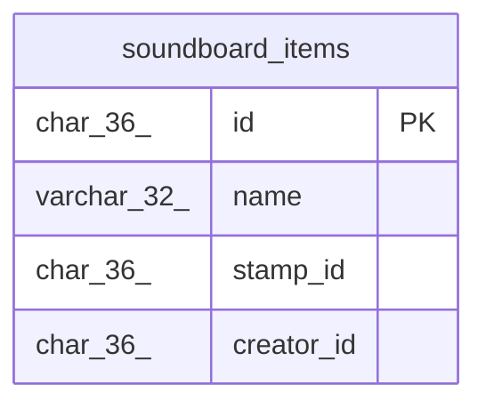

# soundboard_items

## Description

サウンドボードアイテムテーブル

<details>
<summary><strong>Table Definition</strong></summary>

```sql
CREATE TABLE `soundboard_items` (
  `id` char(36) NOT NULL,
  `name` varchar(32) NOT NULL,
  `stamp_id` char(36) DEFAULT NULL,
  `creator_id` char(36) NOT NULL,
  PRIMARY KEY (`id`)
) ENGINE=InnoDB DEFAULT CHARSET=utf8mb4
```

</details>

## Columns

| Name | Type | Default | Nullable | Children | Parents | Comment |
| ---- | ---- | ------- | -------- | -------- | ------- | ------- |
| id | char(36) |  | false |  |  |  |
| name | varchar(32) |  | false |  |  | アイテム名 |
| stamp_id | char(36) | NULL | true |  |  | スタンプUUID |
| creator_id | char(36) |  | false |  |  | アイテム作成者UUID |

## Constraints

| Name | Type | Definition |
| ---- | ---- | ---------- |
| PRIMARY | PRIMARY KEY | PRIMARY KEY (id) |

## Indexes

| Name | Definition |
| ---- | ---------- |
| PRIMARY | PRIMARY KEY (id) USING BTREE |

## Relations



---

> Generated by [tbls](https://github.com/k1LoW/tbls)
