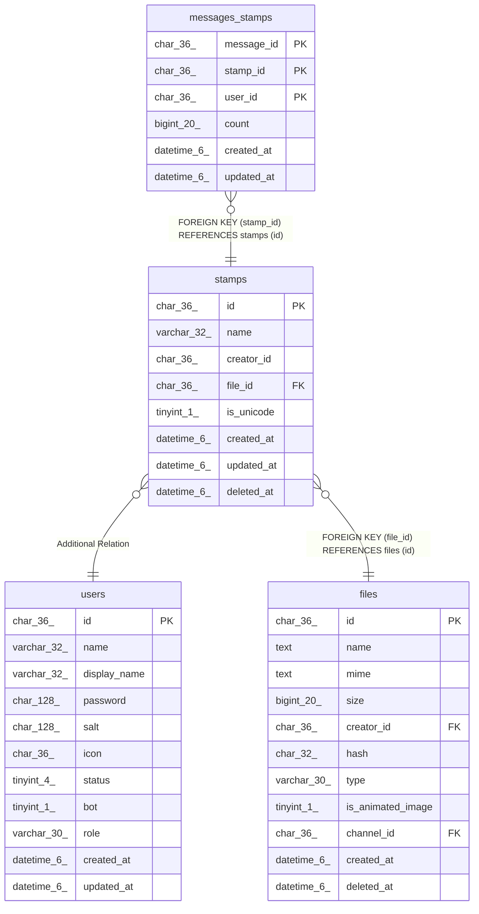

# stamps

## Description

スタンプテーブル

<details>
<summary><strong>Table Definition</strong></summary>

```sql
CREATE TABLE `stamps` (
  `id` char(36) NOT NULL,
  `name` varchar(32) NOT NULL,
  `creator_id` char(36) NOT NULL,
  `file_id` char(36) NOT NULL,
  `is_unicode` tinyint(1) NOT NULL DEFAULT 0,
  `created_at` datetime(6) DEFAULT NULL,
  `updated_at` datetime(6) DEFAULT NULL,
  `deleted_at` datetime(6) DEFAULT NULL,
  PRIMARY KEY (`id`),
  UNIQUE KEY `uni_stamps_name` (`name`),
  KEY `idx_stamps_is_unicode` (`is_unicode`),
  KEY `stamps_file_id_files_id_foreign` (`file_id`),
  CONSTRAINT `stamps_file_id_files_id_foreign` FOREIGN KEY (`file_id`) REFERENCES `files` (`id`) ON DELETE NO ACTION ON UPDATE CASCADE
) ENGINE=InnoDB DEFAULT CHARSET=utf8mb4
```

</details>

## Columns

| Name | Type | Default | Nullable | Children | Parents | Comment |
| ---- | ---- | ------- | -------- | -------- | ------- | ------- |
| id | char(36) |  | false | [messages_stamps](messages_stamps.md) |  | スタンプUUID |
| name | varchar(32) |  | false |  |  | スタンプ名 |
| creator_id | char(36) |  | false |  | [users](users.md) | 作成者UUID |
| file_id | char(36) |  | false |  | [files](files.md) | ファイルUUID |
| is_unicode | tinyint(1) | 0 | false |  |  | Unicode絵文字かどうか |
| created_at | datetime(6) | NULL | true |  |  | 作成日時 |
| updated_at | datetime(6) | NULL | true |  |  | 更新日時 |
| deleted_at | datetime(6) | NULL | true |  |  | 削除日時 |

## Constraints

| Name | Type | Definition |
| ---- | ---- | ---------- |
| PRIMARY | PRIMARY KEY | PRIMARY KEY (id) |
| stamps_file_id_files_id_foreign | FOREIGN KEY | FOREIGN KEY (file_id) REFERENCES files (id) |
| uni_stamps_name | UNIQUE | UNIQUE KEY uni_stamps_name (name) |

## Indexes

| Name | Definition |
| ---- | ---------- |
| idx_stamps_is_unicode | KEY idx_stamps_is_unicode (is_unicode) USING BTREE |
| stamps_file_id_files_id_foreign | KEY stamps_file_id_files_id_foreign (file_id) USING BTREE |
| PRIMARY | PRIMARY KEY (id) USING BTREE |
| uni_stamps_name | UNIQUE KEY uni_stamps_name (name) USING BTREE |

## Relations



---

> Generated by [tbls](https://github.com/k1LoW/tbls)
