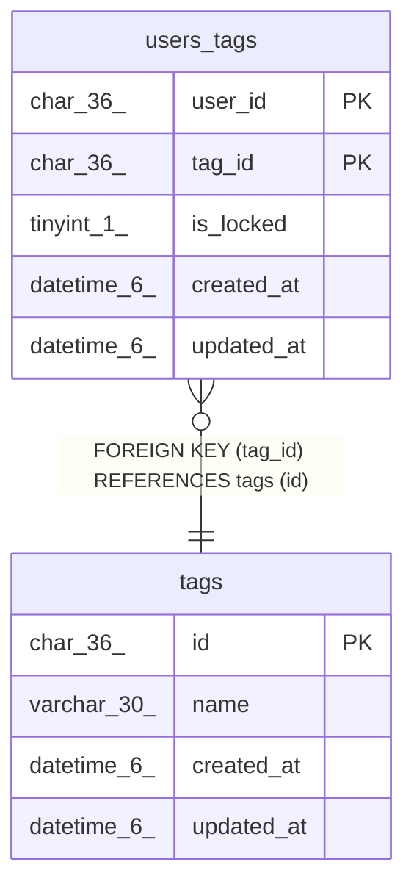

# tags

## Description

タグテーブル

<details>
<summary><strong>Table Definition</strong></summary>

```sql
CREATE TABLE `tags` (
  `id` char(36) NOT NULL,
  `name` varchar(30) CHARACTER SET utf8mb4 COLLATE utf8mb4_bin NOT NULL,
  `created_at` datetime(6) DEFAULT NULL,
  `updated_at` datetime(6) DEFAULT NULL,
  PRIMARY KEY (`id`),
  UNIQUE KEY `name` (`name`)
) ENGINE=InnoDB DEFAULT CHARSET=utf8mb4
```

</details>

## Columns

| Name | Type | Default | Nullable | Children | Parents | Comment |
| ---- | ---- | ------- | -------- | -------- | ------- | ------- |
| id | char(36) |  | false | [users_tags](users_tags.md) |  | タグUUID |
| name | varchar(30) |  | false |  |  | タグ文字列 |
| created_at | datetime(6) | NULL | true |  |  | 作成日時 |
| updated_at | datetime(6) | NULL | true |  |  | 更新日時 |

## Constraints

| Name | Type | Definition |
| ---- | ---- | ---------- |
| name | UNIQUE | UNIQUE KEY name (name) |
| PRIMARY | PRIMARY KEY | PRIMARY KEY (id) |

## Indexes

| Name | Definition |
| ---- | ---------- |
| PRIMARY | PRIMARY KEY (id) USING BTREE |
| name | UNIQUE KEY name (name) USING BTREE |

## Relations



---

> Generated by [tbls](https://github.com/k1LoW/tbls)
