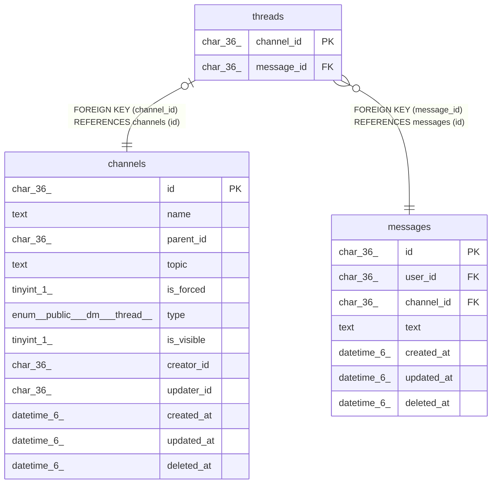

# threads

## Description

スレッドテーブル

<details>
<summary><strong>Table Definition</strong></summary>

```sql
CREATE TABLE `threads` (
  `channel_id` char(36) NOT NULL,
  `message_id` char(36) NOT NULL,
  PRIMARY KEY (`channel_id`),
  KEY `idx_threads_message_id` (`message_id`),
  CONSTRAINT `threads_channel_id_channels_id_foreign` FOREIGN KEY (`channel_id`) REFERENCES `channels` (`id`) ON DELETE CASCADE ON UPDATE CASCADE,
  CONSTRAINT `threads_message_id_messages_id_foreign` FOREIGN KEY (`message_id`) REFERENCES `messages` (`id`) ON DELETE CASCADE ON UPDATE CASCADE
) ENGINE=InnoDB DEFAULT CHARSET=utf8mb4
```

</details>

## Columns

| Name | Type | Default | Nullable | Children | Parents | Comment |
| ---- | ---- | ------- | -------- | -------- | ------- | ------- |
| channel_id | char(36) |  | false |  | [channels](channels.md) | スレッドチャンネルUUID |
| message_id | char(36) |  | false |  | [messages](messages.md) | 親メッセージUUID |

## Constraints

| Name | Type | Definition |
| ---- | ---- | ---------- |
| PRIMARY | PRIMARY KEY | PRIMARY KEY (channel_id) |
| threads_channel_id_channels_id_foreign | FOREIGN KEY | FOREIGN KEY (channel_id) REFERENCES channels (id) |
| threads_message_id_messages_id_foreign | FOREIGN KEY | FOREIGN KEY (message_id) REFERENCES messages (id) |

## Indexes

| Name | Definition |
| ---- | ---------- |
| idx_threads_message_id | KEY idx_threads_message_id (message_id) USING BTREE |
| PRIMARY | PRIMARY KEY (channel_id) USING BTREE |

## Relations



---

> Generated by [tbls](https://github.com/k1LoW/tbls)
