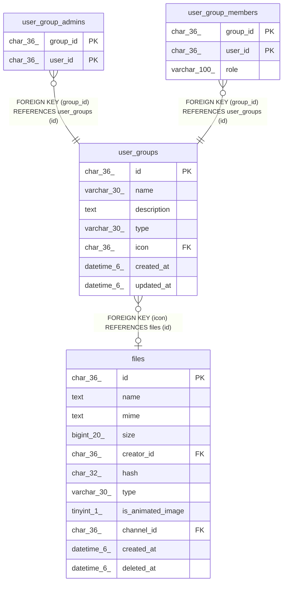

# user_groups

## Description

ユーザーグループテーブル

<details>
<summary><strong>Table Definition</strong></summary>

```sql
CREATE TABLE `user_groups` (
  `id` char(36) NOT NULL,
  `name` varchar(30) NOT NULL,
  `description` text NOT NULL,
  `type` varchar(30) NOT NULL DEFAULT '',
  `icon` char(36) DEFAULT NULL,
  `created_at` datetime(6) DEFAULT NULL,
  `updated_at` datetime(6) DEFAULT NULL,
  PRIMARY KEY (`id`),
  UNIQUE KEY `uni_user_groups_name` (`name`),
  KEY `user_group_icon_files_id_foreign` (`icon`),
  CONSTRAINT `user_group_icon_files_id_foreign` FOREIGN KEY (`icon`) REFERENCES `files` (`id`) ON DELETE SET NULL ON UPDATE CASCADE
) ENGINE=InnoDB DEFAULT CHARSET=utf8mb4
```

</details>

## Columns

| Name | Type | Default | Nullable | Children | Parents | Comment |
| ---- | ---- | ------- | -------- | -------- | ------- | ------- |
| id | char(36) |  | false | [user_group_admins](user_group_admins.md) [user_group_members](user_group_members.md) |  |  |
| name | varchar(30) |  | false |  |  | グループ名 |
| description | text |  | false |  |  | グループ説明 |
| type | varchar(30) | '' | false |  |  | グループタイプ |
| icon | char(36) | NULL | true |  | [files](files.md) | アイコンファイルUUID |
| created_at | datetime(6) | NULL | true |  |  |  |
| updated_at | datetime(6) | NULL | true |  |  |  |

## Constraints

| Name | Type | Definition |
| ---- | ---- | ---------- |
| PRIMARY | PRIMARY KEY | PRIMARY KEY (id) |
| uni_user_groups_name | UNIQUE | UNIQUE KEY uni_user_groups_name (name) |
| user_group_icon_files_id_foreign | FOREIGN KEY | FOREIGN KEY (icon) REFERENCES files (id) |

## Indexes

| Name | Definition |
| ---- | ---------- |
| user_group_icon_files_id_foreign | KEY user_group_icon_files_id_foreign (icon) USING BTREE |
| PRIMARY | PRIMARY KEY (id) USING BTREE |
| uni_user_groups_name | UNIQUE KEY uni_user_groups_name (name) USING BTREE |

## Relations



---

> Generated by [tbls](https://github.com/k1LoW/tbls)
