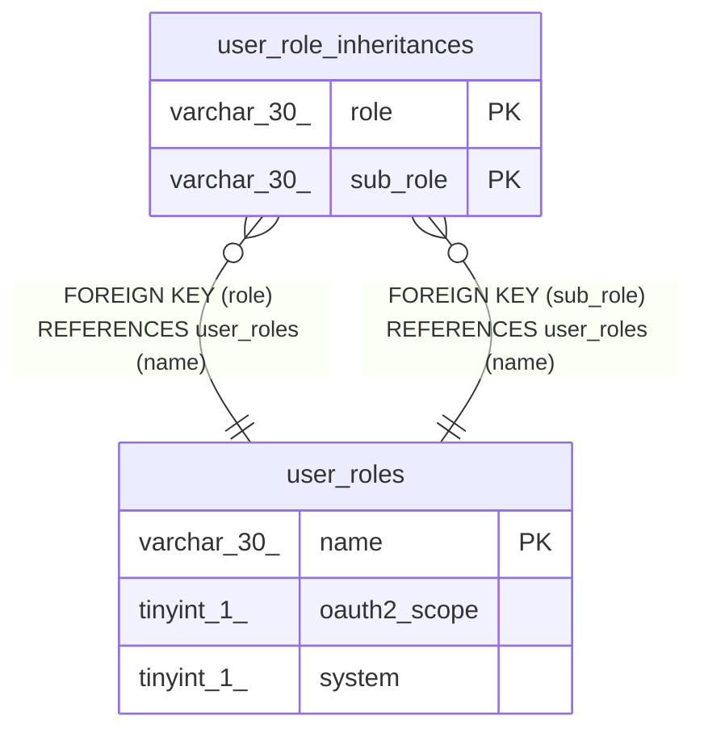

# user_role_inheritances

## Description

ユーザーロール継承テーブル

<details>
<summary><strong>Table Definition</strong></summary>

```sql
CREATE TABLE `user_role_inheritances` (
  `role` varchar(30) NOT NULL,
  `sub_role` varchar(30) NOT NULL,
  PRIMARY KEY (`role`,`sub_role`),
  KEY `fk_user_role_inheritances_inheritances` (`sub_role`),
  CONSTRAINT `fk_user_role_inheritances_inheritances` FOREIGN KEY (`sub_role`) REFERENCES `user_roles` (`name`) ON DELETE CASCADE ON UPDATE CASCADE,
  CONSTRAINT `fk_user_role_inheritances_user_role` FOREIGN KEY (`role`) REFERENCES `user_roles` (`name`) ON DELETE CASCADE ON UPDATE CASCADE
) ENGINE=InnoDB DEFAULT CHARSET=utf8mb4
```

</details>

## Columns

| Name | Type | Default | Nullable | Children | Parents | Comment |
| ---- | ---- | ------- | -------- | -------- | ------- | ------- |
| role | varchar(30) |  | false |  | [user_roles](user_roles.md) | ロール名 |
| sub_role | varchar(30) |  | false |  | [user_roles](user_roles.md) | サブロール名 |

## Constraints

| Name | Type | Definition |
| ---- | ---- | ---------- |
| fk_user_role_inheritances_inheritances | FOREIGN KEY | FOREIGN KEY (sub_role) REFERENCES user_roles (name) |
| fk_user_role_inheritances_user_role | FOREIGN KEY | FOREIGN KEY (role) REFERENCES user_roles (name) |
| PRIMARY | PRIMARY KEY | PRIMARY KEY (role, sub_role) |

## Indexes

| Name | Definition |
| ---- | ---------- |
| fk_user_role_inheritances_inheritances | KEY fk_user_role_inheritances_inheritances (sub_role) USING BTREE |
| PRIMARY | PRIMARY KEY (role, sub_role) USING BTREE |

## Relations



---

> Generated by [tbls](https://github.com/k1LoW/tbls)
