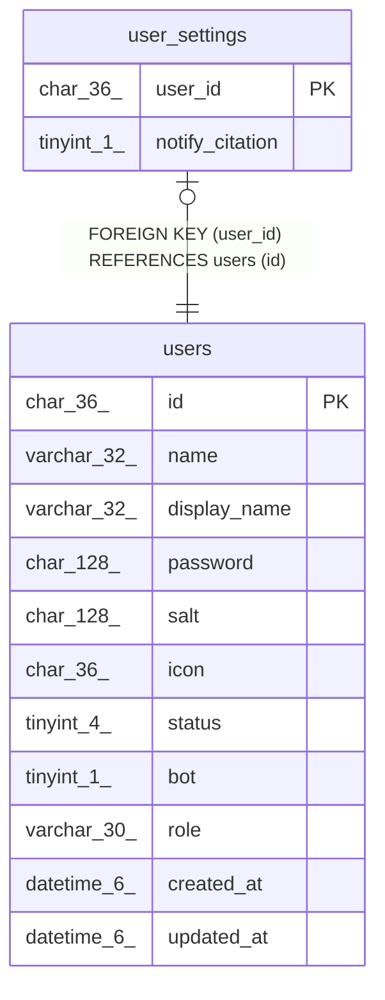

# user_settings

## Description

ユーザー設定

<details>
<summary><strong>Table Definition</strong></summary>

```sql
CREATE TABLE `user_settings` (
  `user_id` char(36) NOT NULL,
  `notify_citation` tinyint(1) DEFAULT NULL,
  PRIMARY KEY (`user_id`),
  CONSTRAINT `user_settings_user_id_users_id_foreign` FOREIGN KEY (`user_id`) REFERENCES `users` (`id`) ON DELETE CASCADE ON UPDATE CASCADE
) ENGINE=InnoDB DEFAULT CHARSET=utf8mb4
```

</details>

## Columns

| Name | Type | Default | Nullable | Children | Parents | Comment |
| ---- | ---- | ------- | -------- | -------- | ------- | ------- |
| user_id | char(36) |  | false |  | [users](users.md) | ユーザーUUID |
| notify_citation | tinyint(1) | NULL | true |  |  | メッセージ引用通知 |

## Constraints

| Name | Type | Definition |
| ---- | ---- | ---------- |
| PRIMARY | PRIMARY KEY | PRIMARY KEY (user_id) |
| user_settings_user_id_users_id_foreign | FOREIGN KEY | FOREIGN KEY (user_id) REFERENCES users (id) |

## Indexes

| Name | Definition |
| ---- | ---------- |
| PRIMARY | PRIMARY KEY (user_id) USING BTREE |

## Relations



---

> Generated by [tbls](https://github.com/k1LoW/tbls)
