# users

## Description

ユーザーテーブル

<details>
<summary><strong>Table Definition</strong></summary>

```sql
CREATE TABLE `users` (
  `id` char(36) NOT NULL,
  `name` varchar(32) NOT NULL,
  `display_name` varchar(32) NOT NULL DEFAULT '',
  `password` char(128) NOT NULL DEFAULT '',
  `salt` char(128) NOT NULL DEFAULT '',
  `icon` char(36) NOT NULL,
  `status` tinyint(4) NOT NULL DEFAULT 0,
  `bot` tinyint(1) NOT NULL DEFAULT 0,
  `role` varchar(30) NOT NULL DEFAULT 'user',
  `created_at` datetime(6) DEFAULT NULL,
  `updated_at` datetime(6) DEFAULT NULL,
  PRIMARY KEY (`id`),
  UNIQUE KEY `uni_users_name` (`name`)
) ENGINE=InnoDB DEFAULT CHARSET=utf8mb4
```

</details>

## Columns

| Name | Type | Default | Nullable | Children | Parents | Comment |
| ---- | ---- | ------- | -------- | -------- | ------- | ------- |
| id | char(36) |  | false | [bots](bots.md) [clip_folders](clip_folders.md) [devices](devices.md) [dm_channel_mappings](dm_channel_mappings.md) [external_provider_users](external_provider_users.md) [files](files.md) [messages](messages.md) [messages_stamps](messages_stamps.md) [pins](pins.md) [stamp_palettes](stamp_palettes.md) [stars](stars.md) [unreads](unreads.md) [users_private_channels](users_private_channels.md) [users_subscribe_channels](users_subscribe_channels.md) [users_subscribe_threads](users_subscribe_threads.md) [users_tags](users_tags.md) [user_profiles](user_profiles.md) [user_settings](user_settings.md) [webhook_bots](webhook_bots.md) [channels](channels.md) [stamps](stamps.md) |  | ユーザーUUID |
| name | varchar(32) |  | false |  |  | traP ID |
| display_name | varchar(32) | '' | false |  |  | 表示名 |
| password | char(128) | '' | false |  |  | ハッシュ化されたパスワード |
| salt | char(128) | '' | false |  |  | パスワードソルト |
| icon | char(36) |  | false |  | [files](files.md) | アイコンファイルUUID |
| status | tinyint(4) | 0 | false |  |  | アカウント状態 |
| bot | tinyint(1) | 0 | false |  |  | BOTユーザーかどうか |
| role | varchar(30) | 'user' | false |  |  | ユーザーロール |
| created_at | datetime(6) | NULL | true |  |  | 作成日時 |
| updated_at | datetime(6) | NULL | true |  |  | 更新日時 |

## Constraints

| Name | Type | Definition |
| ---- | ---- | ---------- |
| PRIMARY | PRIMARY KEY | PRIMARY KEY (id) |
| uni_users_name | UNIQUE | UNIQUE KEY uni_users_name (name) |

## Indexes

| Name | Definition |
| ---- | ---------- |
| PRIMARY | PRIMARY KEY (id) USING BTREE |
| uni_users_name | UNIQUE KEY uni_users_name (name) USING BTREE |

## Relations

```mermaid
erDiagram

"bots" |o--|| "users" : "FOREIGN KEY (bot_user_id) REFERENCES users (id)"
"bots" }o--|| "users" : "FOREIGN KEY (creator_id) REFERENCES users (id)"
"clip_folders" }o--|| "users" : "FOREIGN KEY (owner_id) REFERENCES users (id)"
"devices" }o--|| "users" : "FOREIGN KEY (user_id) REFERENCES users (id)"
"dm_channel_mappings" }o--|| "users" : "FOREIGN KEY (user1) REFERENCES users (id)"
"dm_channel_mappings" }o--|| "users" : "FOREIGN KEY (user2) REFERENCES users (id)"
"external_provider_users" }o--|| "users" : "FOREIGN KEY (user_id) REFERENCES users (id)"
"files" }o--o| "users" : "FOREIGN KEY (creator_id) REFERENCES users (id)"
"messages" }o--|| "users" : "FOREIGN KEY (user_id) REFERENCES users (id)"
"messages_stamps" }o--|| "users" : "FOREIGN KEY (user_id) REFERENCES users (id)"
"pins" }o--|| "users" : "FOREIGN KEY (user_id) REFERENCES users (id)"
"stamp_palettes" }o--|| "users" : "FOREIGN KEY (creator_id) REFERENCES users (id)"
"stars" }o--|| "users" : "FOREIGN KEY (user_id) REFERENCES users (id)"
"unreads" }o--|| "users" : "FOREIGN KEY (user_id) REFERENCES users (id)"
"users_private_channels" }o--|| "users" : "FOREIGN KEY (user_id) REFERENCES users (id)"
"users_subscribe_channels" }o--|| "users" : "FOREIGN KEY (user_id) REFERENCES users (id)"
"users_subscribe_threads" }o--|| "users" : "FOREIGN KEY (user_id) REFERENCES users (id)"
"users_tags" }o--|| "users" : "FOREIGN KEY (user_id) REFERENCES users (id)"
"user_profiles" |o--|| "users" : "FOREIGN KEY (user_id) REFERENCES users (id)"
"user_settings" |o--|| "users" : "FOREIGN KEY (user_id) REFERENCES users (id)"
"webhook_bots" |o--|| "users" : "FOREIGN KEY (bot_user_id) REFERENCES users (id)"
"webhook_bots" }o--|| "users" : "FOREIGN KEY (creator_id) REFERENCES users (id)"
"channels" }o--|| "users" : "Additional Relation"
"stamps" }o--|| "users" : "Additional Relation"
"users" }o--|| "files" : "Additional Relation"

"users" {
  char_36_ id PK
  varchar_32_ name
  varchar_32_ display_name
  char_128_ password
  char_128_ salt
  char_36_ icon
  tinyint_4_ status
  tinyint_1_ bot
  varchar_30_ role
  datetime_6_ created_at
  datetime_6_ updated_at
}
"bots" {
  char_36_ id PK
  char_36_ bot_user_id FK
  text description
  varchar_30_ verification_token
  char_36_ access_token_id
  text post_url
  text subscribe_events
  tinyint_1_ privileged
  varchar_30_ mode
  tinyint_4_ state
  varchar_30_ bot_code
  char_36_ creator_id FK
  datetime_6_ created_at
  datetime_6_ updated_at
  datetime_6_ deleted_at
}
"clip_folders" {
  char_36_ id PK
  varchar_30_ name
  text description
  char_36_ owner_id FK
  datetime_6_ created_at
}
"devices" {
  varchar_190_ token PK
  char_36_ user_id FK
  datetime_6_ created_at
}
"dm_channel_mappings" {
  char_36_ channel_id PK
  char_36_ user1 FK
  char_36_ user2 FK
}
"external_provider_users" {
  char_36_ user_id PK
  varchar_30_ provider_name PK
  varchar_100_ external_id
  text extra
  datetime_6_ created_at
  datetime_6_ updated_at
}
"files" {
  char_36_ id PK
  text name
  text mime
  bigint_20_ size
  char_36_ creator_id FK
  char_32_ hash
  varchar_30_ type
  tinyint_1_ is_animated_image
  char_36_ channel_id FK
  datetime_6_ created_at
  datetime_6_ deleted_at
}
"messages" {
  char_36_ id PK
  char_36_ user_id FK
  char_36_ channel_id FK
  text text
  datetime_6_ created_at
  datetime_6_ updated_at
  datetime_6_ deleted_at
}
"messages_stamps" {
  char_36_ message_id PK
  char_36_ stamp_id PK
  char_36_ user_id PK
  bigint_20_ count
  datetime_6_ created_at
  datetime_6_ updated_at
}
"pins" {
  char_36_ id PK
  char_36_ message_id FK
  char_36_ user_id FK
  datetime_6_ created_at
}
"stamp_palettes" {
  char_36_ id PK
  varchar_30_ name
  text description
  text stamps
  char_36_ creator_id FK
  datetime_6_ created_at
  datetime_6_ updated_at
}
"stars" {
  char_36_ user_id PK
  char_36_ channel_id PK
}
"unreads" {
  char_36_ user_id PK
  char_36_ channel_id PK
  char_36_ message_id PK
  tinyint_1_ noticeable
  datetime_6_ message_created_at
}
"users_private_channels" {
  char_36_ user_id PK
  char_36_ channel_id PK
}
"users_subscribe_channels" {
  char_36_ user_id PK
  char_36_ channel_id PK
  tinyint_1_ mark
  tinyint_1_ notify
}
"users_subscribe_threads" {
  char_36_ user_id PK
  char_36_ channel_id PK
  tinyint_1_ mark
  tinyint_1_ notify
}
"users_tags" {
  char_36_ user_id PK
  char_36_ tag_id PK
  tinyint_1_ is_locked
  datetime_6_ created_at
  datetime_6_ updated_at
}
"user_profiles" {
  char_36_ user_id PK
  text bio
  varchar_15_ twitter_id
  datetime_6_ last_online
  char_36_ home_channel FK
  datetime_6_ updated_at
}
"user_settings" {
  char_36_ user_id PK
  tinyint_1_ notify_citation
}
"webhook_bots" {
  char_36_ id PK
  char_36_ bot_user_id FK
  text description
  text secret
  char_36_ channel_id FK
  char_36_ creator_id FK
  datetime_6_ created_at
  datetime_6_ updated_at
  datetime_6_ deleted_at
}
"channels" {
  char_36_ id PK
  varchar_20_ name
  char_36_ parent_id
  text topic
  tinyint_1_ is_forced
  tinyint_1_ is_public
  tinyint_1_ is_visible
  tinyint_1_ is_thread
  char_36_ creator_id
  char_36_ updater_id
  datetime_6_ created_at
  datetime_6_ updated_at
  datetime_6_ deleted_at
}
"stamps" {
  char_36_ id PK
  varchar_32_ name
  char_36_ creator_id
  char_36_ file_id FK
  tinyint_1_ is_unicode
  datetime_6_ created_at
  datetime_6_ updated_at
  datetime_6_ deleted_at
}
```



---

> Generated by [tbls](https://github.com/k1LoW/tbls)
