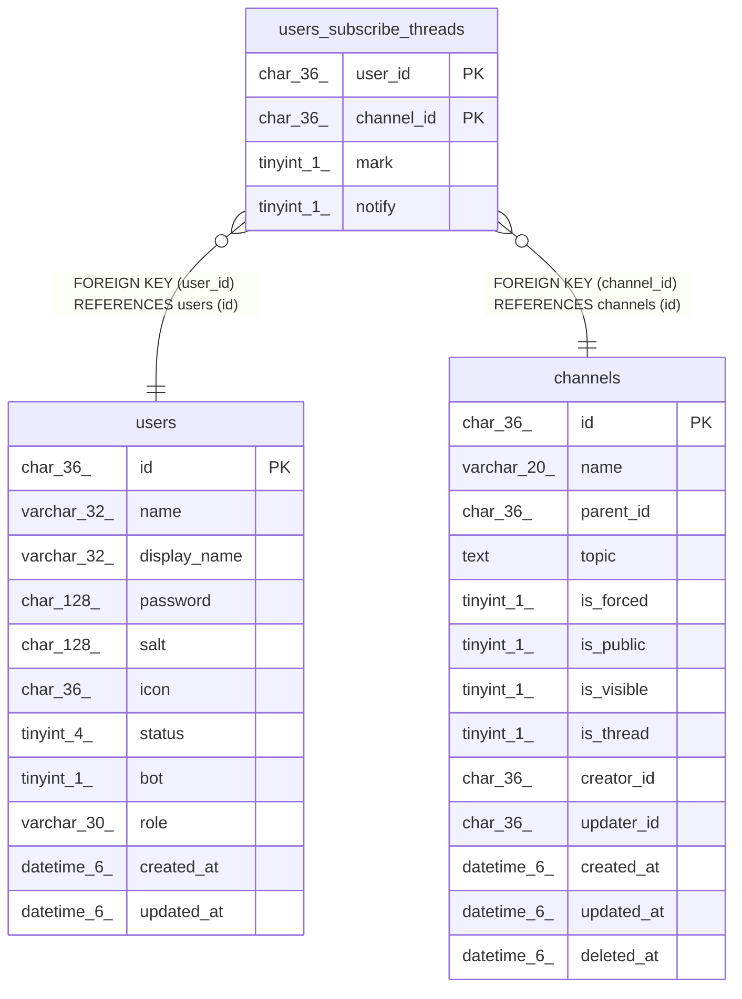

# users_subscribe_threads

## Description

<details>
<summary><strong>Table Definition</strong></summary>

```sql
CREATE TABLE `users_subscribe_threads` (
  `user_id` char(36) NOT NULL,
  `channel_id` char(36) NOT NULL,
  `mark` tinyint(1) NOT NULL DEFAULT 0,
  `notify` tinyint(1) NOT NULL DEFAULT 0,
  PRIMARY KEY (`user_id`,`channel_id`),
  KEY `users_subscribe_threads_channel_id_channels_id_foreign` (`channel_id`),
  CONSTRAINT `users_subscribe_threads_channel_id_channels_id_foreign` FOREIGN KEY (`channel_id`) REFERENCES `channels` (`id`) ON DELETE CASCADE ON UPDATE CASCADE,
  CONSTRAINT `users_subscribe_threads_user_id_users_id_foreign` FOREIGN KEY (`user_id`) REFERENCES `users` (`id`) ON DELETE CASCADE ON UPDATE CASCADE
) ENGINE=InnoDB DEFAULT CHARSET=utf8mb4
```

</details>

## Columns

| Name | Type | Default | Nullable | Children | Parents | Comment |
| ---- | ---- | ------- | -------- | -------- | ------- | ------- |
| user_id | char(36) |  | false |  | [users](users.md) |  |
| channel_id | char(36) |  | false |  | [channels](channels.md) |  |
| mark | tinyint(1) | 0 | false |  |  |  |
| notify | tinyint(1) | 0 | false |  |  |  |

## Constraints

| Name | Type | Definition |
| ---- | ---- | ---------- |
| PRIMARY | PRIMARY KEY | PRIMARY KEY (user_id, channel_id) |
| users_subscribe_threads_channel_id_channels_id_foreign | FOREIGN KEY | FOREIGN KEY (channel_id) REFERENCES channels (id) |
| users_subscribe_threads_user_id_users_id_foreign | FOREIGN KEY | FOREIGN KEY (user_id) REFERENCES users (id) |

## Indexes

| Name | Definition |
| ---- | ---------- |
| users_subscribe_threads_channel_id_channels_id_foreign | KEY users_subscribe_threads_channel_id_channels_id_foreign (channel_id) USING BTREE |
| PRIMARY | PRIMARY KEY (user_id, channel_id) USING BTREE |

## Relations



---

> Generated by [tbls](https://github.com/k1LoW/tbls)
