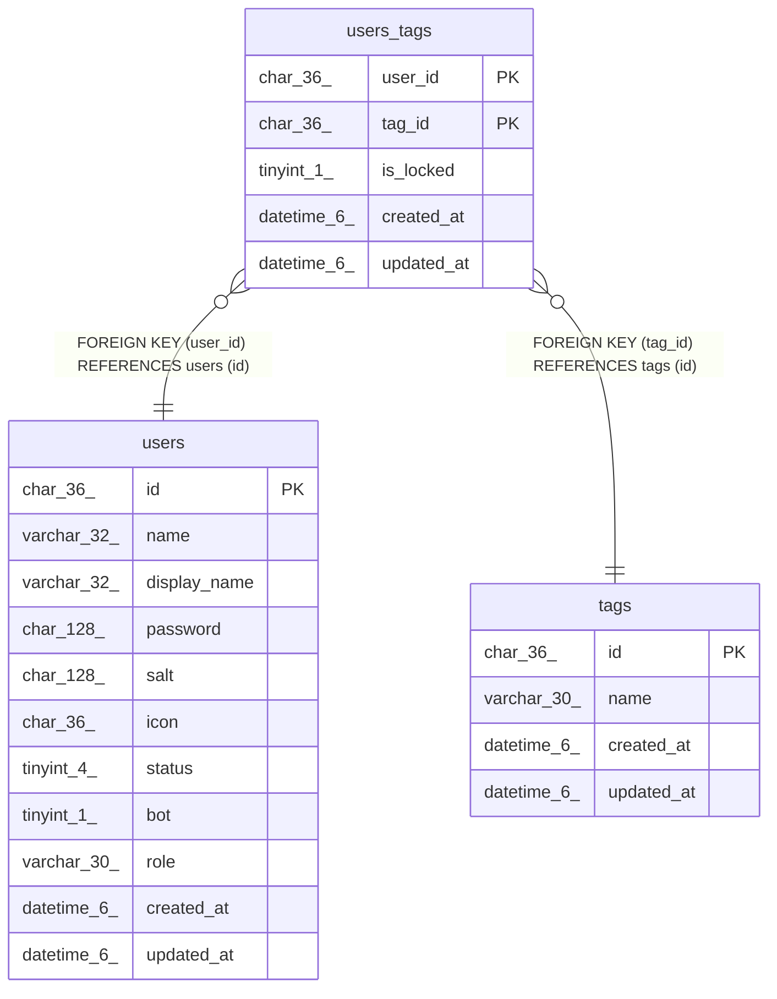

# users_tags

## Description

ユーザータグテーブル

<details>
<summary><strong>Table Definition</strong></summary>

```sql
CREATE TABLE `users_tags` (
  `user_id` char(36) NOT NULL,
  `tag_id` char(36) NOT NULL,
  `is_locked` tinyint(1) NOT NULL DEFAULT 0,
  `created_at` datetime(6) DEFAULT NULL,
  `updated_at` datetime(6) DEFAULT NULL,
  PRIMARY KEY (`user_id`,`tag_id`),
  KEY `idx_users_tags_created_at` (`created_at`),
  KEY `users_tags_tag_id_tags_id_foreign` (`tag_id`),
  CONSTRAINT `users_tags_tag_id_tags_id_foreign` FOREIGN KEY (`tag_id`) REFERENCES `tags` (`id`) ON DELETE CASCADE ON UPDATE CASCADE,
  CONSTRAINT `users_tags_user_id_users_id_foreign` FOREIGN KEY (`user_id`) REFERENCES `users` (`id`) ON DELETE CASCADE ON UPDATE CASCADE
) ENGINE=InnoDB DEFAULT CHARSET=utf8mb4
```

</details>

## Columns

| Name | Type | Default | Nullable | Children | Parents | Comment |
| ---- | ---- | ------- | -------- | -------- | ------- | ------- |
| user_id | char(36) |  | false |  | [users](users.md) | ユーザーUUID |
| tag_id | char(36) |  | false |  | [tags](tags.md) | タグUUID |
| is_locked | tinyint(1) | 0 | false |  |  | ロックされているかどうか |
| created_at | datetime(6) | NULL | true |  |  | 作成日時 |
| updated_at | datetime(6) | NULL | true |  |  | 更新日時 |

## Constraints

| Name | Type | Definition |
| ---- | ---- | ---------- |
| PRIMARY | PRIMARY KEY | PRIMARY KEY (user_id, tag_id) |
| users_tags_tag_id_tags_id_foreign | FOREIGN KEY | FOREIGN KEY (tag_id) REFERENCES tags (id) |
| users_tags_user_id_users_id_foreign | FOREIGN KEY | FOREIGN KEY (user_id) REFERENCES users (id) |

## Indexes

| Name | Definition |
| ---- | ---------- |
| idx_users_tags_created_at | KEY idx_users_tags_created_at (created_at) USING BTREE |
| users_tags_tag_id_tags_id_foreign | KEY users_tags_tag_id_tags_id_foreign (tag_id) USING BTREE |
| PRIMARY | PRIMARY KEY (user_id, tag_id) USING BTREE |

## Relations



---

> Generated by [tbls](https://github.com/k1LoW/tbls)
