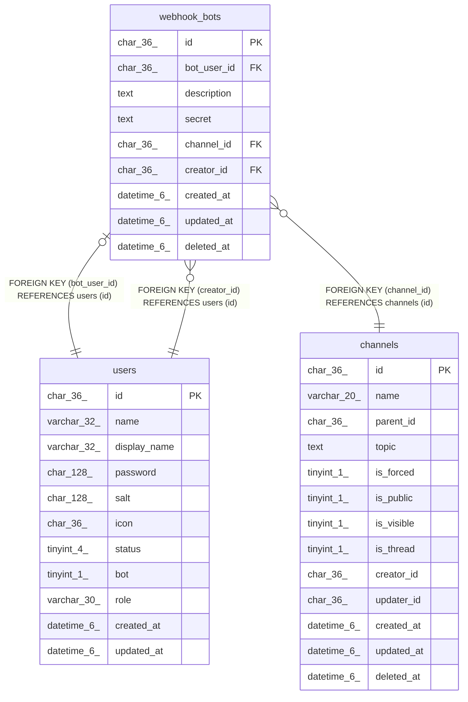

# webhook_bots

## Description

traQ Webhookテーブル

<details>
<summary><strong>Table Definition</strong></summary>

```sql
CREATE TABLE `webhook_bots` (
  `id` char(36) NOT NULL,
  `bot_user_id` char(36) NOT NULL,
  `description` text NOT NULL,
  `secret` text NOT NULL,
  `channel_id` char(36) NOT NULL,
  `creator_id` char(36) NOT NULL,
  `created_at` datetime(6) DEFAULT NULL,
  `updated_at` datetime(6) DEFAULT NULL,
  `deleted_at` datetime(6) DEFAULT NULL,
  PRIMARY KEY (`id`),
  UNIQUE KEY `uni_webhook_bots_bot_user_id` (`bot_user_id`),
  KEY `webhook_bots_creator_id_users_id_foreign` (`creator_id`),
  KEY `webhook_bots_channel_id_channels_id_foreign` (`channel_id`),
  CONSTRAINT `webhook_bots_bot_user_id_users_id_foreign` FOREIGN KEY (`bot_user_id`) REFERENCES `users` (`id`) ON DELETE CASCADE ON UPDATE CASCADE,
  CONSTRAINT `webhook_bots_channel_id_channels_id_foreign` FOREIGN KEY (`channel_id`) REFERENCES `channels` (`id`) ON DELETE CASCADE ON UPDATE CASCADE,
  CONSTRAINT `webhook_bots_creator_id_users_id_foreign` FOREIGN KEY (`creator_id`) REFERENCES `users` (`id`) ON DELETE CASCADE ON UPDATE CASCADE
) ENGINE=InnoDB DEFAULT CHARSET=utf8mb4
```

</details>

## Columns

| Name | Type | Default | Nullable | Children | Parents | Comment |
| ---- | ---- | ------- | -------- | -------- | ------- | ------- |
| id | char(36) |  | false |  |  |  |
| bot_user_id | char(36) |  | false |  | [users](users.md) | WebhookユーザーUUID |
| description | text |  | false |  |  | 説明 |
| secret | text |  | false |  |  | BOTシークレット |
| channel_id | char(36) |  | false |  | [channels](channels.md) | デフォルト投稿先チャンネルUUID |
| creator_id | char(36) |  | false |  | [users](users.md) | 作成者UUID |
| created_at | datetime(6) | NULL | true |  |  |  |
| updated_at | datetime(6) | NULL | true |  |  |  |
| deleted_at | datetime(6) | NULL | true |  |  |  |

## Constraints

| Name | Type | Definition |
| ---- | ---- | ---------- |
| PRIMARY | PRIMARY KEY | PRIMARY KEY (id) |
| uni_webhook_bots_bot_user_id | UNIQUE | UNIQUE KEY uni_webhook_bots_bot_user_id (bot_user_id) |
| webhook_bots_bot_user_id_users_id_foreign | FOREIGN KEY | FOREIGN KEY (bot_user_id) REFERENCES users (id) |
| webhook_bots_channel_id_channels_id_foreign | FOREIGN KEY | FOREIGN KEY (channel_id) REFERENCES channels (id) |
| webhook_bots_creator_id_users_id_foreign | FOREIGN KEY | FOREIGN KEY (creator_id) REFERENCES users (id) |

## Indexes

| Name | Definition |
| ---- | ---------- |
| webhook_bots_channel_id_channels_id_foreign | KEY webhook_bots_channel_id_channels_id_foreign (channel_id) USING BTREE |
| webhook_bots_creator_id_users_id_foreign | KEY webhook_bots_creator_id_users_id_foreign (creator_id) USING BTREE |
| PRIMARY | PRIMARY KEY (id) USING BTREE |
| uni_webhook_bots_bot_user_id | UNIQUE KEY uni_webhook_bots_bot_user_id (bot_user_id) USING BTREE |

## Relations



---

> Generated by [tbls](https://github.com/k1LoW/tbls)
