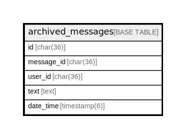

# archived_messages

## Description

アーカイブ化されたメッセージのテーブル(編集前メッセージ)

<details>
<summary><strong>Table Definition</strong></summary>

```sql
CREATE TABLE `archived_messages` (
  `id` char(36) NOT NULL,
  `message_id` char(36) NOT NULL,
  `user_id` char(36) NOT NULL,
  `text` text CHARACTER SET utf8mb4 COLLATE utf8mb4_bin NOT NULL,
  `date_time` datetime(6) DEFAULT NULL,
  PRIMARY KEY (`id`),
  KEY `idx_archived_messages_message_id` (`message_id`)
) ENGINE=InnoDB DEFAULT CHARSET=utf8mb4
```

</details>

## Columns

| Name | Type | Default | Nullable | Children | Parents | Comment |
| ---- | ---- | ------- | -------- | -------- | ------- | ------- |
| id | char(36) |  | false |  |  | アーカイブUUID |
| message_id | char(36) |  | false |  |  | 元のメッセージUUID |
| user_id | char(36) |  | false |  |  | 投稿ユーザーUUID |
| text | text |  | false |  |  | 本文 |
| date_time | datetime(6) |  | true |  |  | 本文の投稿日時 |

## Constraints

| Name | Type | Definition |
| ---- | ---- | ---------- |
| PRIMARY | PRIMARY KEY | PRIMARY KEY (id) |

## Indexes

| Name | Definition |
| ---- | ---------- |
| idx_archived_messages_message_id | KEY idx_archived_messages_message_id (message_id) USING BTREE |
| PRIMARY | PRIMARY KEY (id) USING BTREE |

## Relations



---

> Generated by [tbls](https://github.com/k1LoW/tbls)
