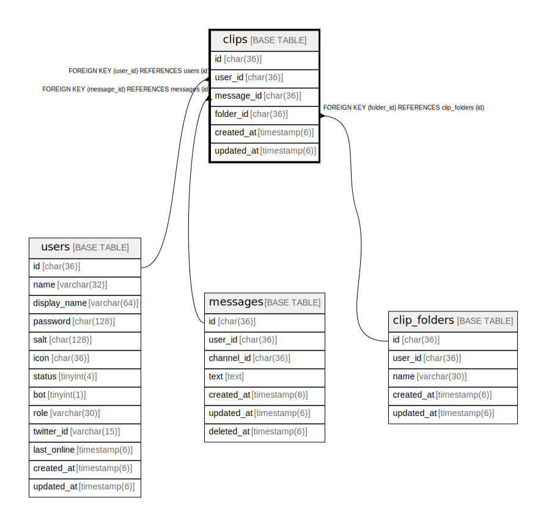

# clips

## Description

クリップテーブル

<details>
<summary><strong>Table Definition</strong></summary>

```sql
CREATE TABLE `clips` (
  `id` char(36) NOT NULL,
  `user_id` char(36) NOT NULL,
  `message_id` char(36) NOT NULL,
  `folder_id` char(36) NOT NULL,
  `created_at` timestamp(6) NULL DEFAULT NULL,
  `updated_at` timestamp(6) NULL DEFAULT NULL,
  PRIMARY KEY (`id`),
  UNIQUE KEY `user_message` (`user_id`,`message_id`),
  KEY `clips_folder_id_clip_folders_id_foreign` (`folder_id`),
  KEY `clips_message_id_messages_id_foreign` (`message_id`),
  CONSTRAINT `clips_folder_id_clip_folders_id_foreign` FOREIGN KEY (`folder_id`) REFERENCES `clip_folders` (`id`) ON DELETE CASCADE ON UPDATE CASCADE,
  CONSTRAINT `clips_message_id_messages_id_foreign` FOREIGN KEY (`message_id`) REFERENCES `messages` (`id`) ON DELETE CASCADE ON UPDATE CASCADE,
  CONSTRAINT `clips_user_id_users_id_foreign` FOREIGN KEY (`user_id`) REFERENCES `users` (`id`) ON DELETE CASCADE ON UPDATE CASCADE
) ENGINE=InnoDB DEFAULT CHARSET=utf8mb4
```

</details>

## Columns

| Name | Type | Default | Nullable | Children | Parents | Comment |
| ---- | ---- | ------- | -------- | -------- | ------- | ------- |
| id | char(36) |  | false |  |  | クリップUUID |
| user_id | char(36) |  | false |  | [users](users.md) | ユーザーUUID |
| message_id | char(36) |  | false |  | [messages](messages.md) | メッセージUUID |
| folder_id | char(36) |  | false |  | [clip_folders](clip_folders.md) | クリップフォルダUUID |
| created_at | timestamp(6) |  | true |  |  | 作成日時 |
| updated_at | timestamp(6) |  | true |  |  | 更新日時 |

## Constraints

| Name | Type | Definition |
| ---- | ---- | ---------- |
| clips_folder_id_clip_folders_id_foreign | FOREIGN KEY | FOREIGN KEY (folder_id) REFERENCES clip_folders (id) |
| clips_message_id_messages_id_foreign | FOREIGN KEY | FOREIGN KEY (message_id) REFERENCES messages (id) |
| clips_user_id_users_id_foreign | FOREIGN KEY | FOREIGN KEY (user_id) REFERENCES users (id) |
| PRIMARY | PRIMARY KEY | PRIMARY KEY (id) |
| user_message | UNIQUE | UNIQUE KEY user_message (user_id, message_id) |

## Indexes

| Name | Definition |
| ---- | ---------- |
| clips_folder_id_clip_folders_id_foreign | KEY clips_folder_id_clip_folders_id_foreign (folder_id) USING BTREE |
| clips_message_id_messages_id_foreign | KEY clips_message_id_messages_id_foreign (message_id) USING BTREE |
| PRIMARY | PRIMARY KEY (id) USING BTREE |
| user_message | UNIQUE KEY user_message (user_id, message_id) USING BTREE |

## Relations



---

> Generated by [tbls](https://github.com/k1LoW/tbls)
