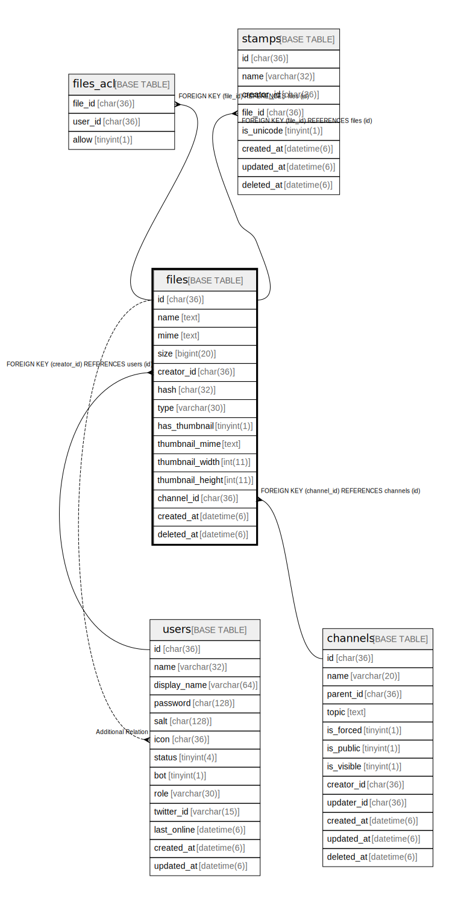

# files

## Description

ファイルテーブル

<details>
<summary><strong>Table Definition</strong></summary>

```sql
CREATE TABLE `files` (
  `id` char(36) NOT NULL,
  `name` text NOT NULL,
  `mime` text NOT NULL,
  `size` bigint(20) NOT NULL,
  `creator_id` char(36) NOT NULL,
  `hash` char(32) NOT NULL,
  `type` varchar(30) NOT NULL DEFAULT '',
  `has_thumbnail` tinyint(1) NOT NULL DEFAULT '0',
  `thumbnail_width` int(11) NOT NULL DEFAULT '0',
  `thumbnail_height` int(11) NOT NULL DEFAULT '0',
  `created_at` timestamp(6) NULL DEFAULT NULL,
  `deleted_at` timestamp(6) NULL DEFAULT NULL,
  PRIMARY KEY (`id`)
) ENGINE=InnoDB DEFAULT CHARSET=utf8mb4
```

</details>

## Columns

| Name | Type | Default | Nullable | Children | Parents | Comment |
| ---- | ---- | ------- | -------- | -------- | ------- | ------- |
| id | char(36) |  | false | [stamps](stamps.md) [users](users.md) |  |  |
| name | text |  | false |  |  | ファイル名 |
| mime | text |  | false |  |  | ファイルMIMEタイプ |
| size | bigint(20) |  | false |  |  | ファイルサイズ(byte) |
| creator_id | char(36) |  | false |  |  | ファイル作成者UUID |
| hash | char(32) |  | false |  |  | MD5ハッシュ |
| type | varchar(30) |  | false |  |  | ファイルタイプ |
| has_thumbnail | tinyint(1) | 0 | false |  |  | サムネイル画像を持っているか |
| thumbnail_width | int(11) | 0 | false |  |  | サムネイル画像幅 |
| thumbnail_height | int(11) | 0 | false |  |  | サムネイル画像高さ |
| created_at | timestamp(6) |  | true |  |  |  |
| deleted_at | timestamp(6) |  | true |  |  |  |

## Constraints

| Name | Type | Definition |
| ---- | ---- | ---------- |
| PRIMARY | PRIMARY KEY | PRIMARY KEY (id) |

## Indexes

| Name | Definition |
| ---- | ---------- |
| PRIMARY | PRIMARY KEY (id) USING BTREE |

## Relations



---

> Generated by [tbls](https://github.com/k1LoW/tbls)
