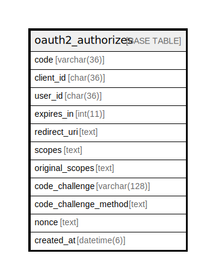

# oauth2_authorizes

## Description

OAuth2認可リクエストテーブル

<details>
<summary><strong>Table Definition</strong></summary>

```sql
CREATE TABLE `oauth2_authorizes` (
  `code` varchar(36) NOT NULL DEFAULT '',
  `client_id` char(36) DEFAULT NULL,
  `user_id` char(36) DEFAULT NULL,
  `expires_in` bigint(20) DEFAULT NULL,
  `redirect_uri` text,
  `scopes` text,
  `original_scopes` text,
  `code_challenge` varchar(128) DEFAULT NULL,
  `code_challenge_method` text,
  `nonce` text,
  `created_at` datetime(6) DEFAULT NULL,
  PRIMARY KEY (`code`)
) ENGINE=InnoDB DEFAULT CHARSET=utf8mb4
```

</details>

## Columns

| Name | Type | Default | Nullable | Children | Parents | Comment |
| ---- | ---- | ------- | -------- | -------- | ------- | ------- |
| code | varchar(36) |  | false |  |  | 認可コード |
| client_id | char(36) |  | true |  |  | クライアントID |
| user_id | char(36) |  | true |  |  | リクエストユーザーUUID |
| expires_in | bigint(20) |  | true |  |  | 有効秒 |
| redirect_uri | text |  | true |  |  | リダイレクトURI |
| scopes | text |  | true |  |  | 認可対象スコープ |
| original_scopes | text |  | true |  |  | 元の要求スコープ |
| code_challenge | varchar(128) |  | true |  |  | PKCEコードチャレンジ |
| code_challenge_method | text |  | true |  |  | PKCEコードチャレンジ方式 |
| nonce | text |  | true |  |  | nonce |
| created_at | datetime(6) |  | true |  |  |  |

## Constraints

| Name | Type | Definition |
| ---- | ---- | ---------- |
| PRIMARY | PRIMARY KEY | PRIMARY KEY (code) |

## Indexes

| Name | Definition |
| ---- | ---------- |
| PRIMARY | PRIMARY KEY (code) USING BTREE |

## Relations



---

> Generated by [tbls](https://github.com/k1LoW/tbls)
