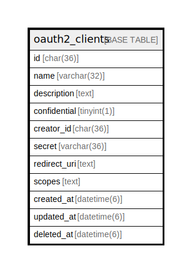

# oauth2_clients

## Description

OAuth2クライアントテーブル

<details>
<summary><strong>Table Definition</strong></summary>

```sql
CREATE TABLE `oauth2_clients` (
  `id` char(36) NOT NULL DEFAULT '',
  `name` varchar(32) DEFAULT NULL,
  `description` text,
  `confidential` tinyint(1) DEFAULT NULL,
  `creator_id` char(36) DEFAULT NULL,
  `secret` varchar(36) DEFAULT NULL,
  `redirect_uri` text,
  `scopes` text,
  `created_at` timestamp(6) NULL DEFAULT NULL,
  `updated_at` timestamp(6) NULL DEFAULT NULL,
  `deleted_at` timestamp(6) NULL DEFAULT NULL,
  PRIMARY KEY (`id`)
) ENGINE=InnoDB DEFAULT CHARSET=utf8mb4
```

</details>

## Columns

| Name | Type | Default | Nullable | Children | Parents | Comment |
| ---- | ---- | ------- | -------- | -------- | ------- | ------- |
| id | char(36) |  | false |  |  |  |
| name | varchar(32) |  | true |  |  | クライアント名 |
| description | text |  | true |  |  | 説明 |
| confidential | tinyint(1) |  | true |  |  | コンフィデンシャルかどうか |
| creator_id | char(36) |  | true |  |  | 作成者UUID |
| secret | varchar(36) |  | true |  |  | クライアントシークレット |
| redirect_uri | text |  | true |  |  | リダイレクトURI |
| scopes | text |  | true |  |  | スコープ |
| created_at | timestamp(6) |  | true |  |  |  |
| updated_at | timestamp(6) |  | true |  |  |  |
| deleted_at | timestamp(6) |  | true |  |  |  |

## Constraints

| Name | Type | Definition |
| ---- | ---- | ---------- |
| PRIMARY | PRIMARY KEY | PRIMARY KEY (id) |

## Indexes

| Name | Definition |
| ---- | ---------- |
| PRIMARY | PRIMARY KEY (id) USING BTREE |

## Relations



---

> Generated by [tbls](https://github.com/k1LoW/tbls)
