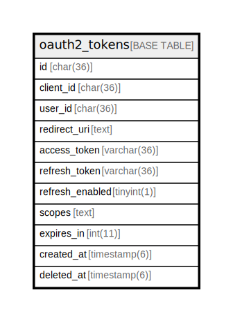

# oauth2_tokens

## Description

OAuth2トークンテーブル

<details>
<summary><strong>Table Definition</strong></summary>

```sql
CREATE TABLE `oauth2_tokens` (
  `id` char(36) NOT NULL DEFAULT '',
  `client_id` char(36) DEFAULT NULL,
  `user_id` char(36) DEFAULT NULL,
  `redirect_uri` text,
  `access_token` varchar(36) DEFAULT NULL,
  `refresh_token` varchar(36) DEFAULT NULL,
  `refresh_enabled` tinyint(1) DEFAULT '0',
  `scopes` text,
  `expires_in` int(11) DEFAULT NULL,
  `created_at` datetime(6) DEFAULT NULL,
  `deleted_at` datetime(6) DEFAULT NULL,
  PRIMARY KEY (`id`),
  UNIQUE KEY `access_token` (`access_token`),
  UNIQUE KEY `refresh_token` (`refresh_token`)
) ENGINE=InnoDB DEFAULT CHARSET=utf8mb4
```

</details>

## Columns

| Name | Type | Default | Nullable | Children | Parents | Comment |
| ---- | ---- | ------- | -------- | -------- | ------- | ------- |
| id | char(36) |  | false |  |  |  |
| client_id | char(36) |  | true |  |  | クライアントID |
| user_id | char(36) |  | true |  |  | ユーザーUUID |
| redirect_uri | text |  | true |  |  | リダイレクトURI |
| access_token | varchar(36) |  | true |  |  | アクセストークン |
| refresh_token | varchar(36) |  | true |  |  | リフレッシュトークン |
| refresh_enabled | tinyint(1) | 0 | true |  |  | リフレッシュトークンが有効かどうか |
| scopes | text |  | true |  |  | スコープ |
| expires_in | int(11) |  | true |  |  | 有効秒 |
| created_at | datetime(6) |  | true |  |  |  |
| deleted_at | datetime(6) |  | true |  |  |  |

## Constraints

| Name | Type | Definition |
| ---- | ---- | ---------- |
| access_token | UNIQUE | UNIQUE KEY access_token (access_token) |
| PRIMARY | PRIMARY KEY | PRIMARY KEY (id) |
| refresh_token | UNIQUE | UNIQUE KEY refresh_token (refresh_token) |

## Indexes

| Name | Definition |
| ---- | ---------- |
| PRIMARY | PRIMARY KEY (id) USING BTREE |
| access_token | UNIQUE KEY access_token (access_token) USING BTREE |
| refresh_token | UNIQUE KEY refresh_token (refresh_token) USING BTREE |

## Relations



---

> Generated by [tbls](https://github.com/k1LoW/tbls)
