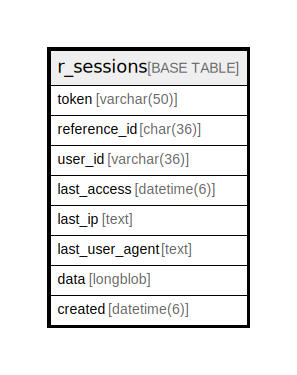

# r_sessions

## Description

traQ API HTTPセッションテーブル

<details>
<summary><strong>Table Definition</strong></summary>

```sql
CREATE TABLE `r_sessions` (
  `token` varchar(50) NOT NULL,
  `reference_id` char(36) DEFAULT NULL,
  `user_id` varchar(36) DEFAULT NULL,
  `data` longblob DEFAULT NULL,
  `created` datetime(6) DEFAULT NULL,
  PRIMARY KEY (`token`),
  UNIQUE KEY `reference_id` (`reference_id`),
  KEY `idx_r_sessions_user_id` (`user_id`)
) ENGINE=InnoDB DEFAULT CHARSET=utf8mb4
```

</details>

## Columns

| Name | Type | Default | Nullable | Children | Parents | Comment |
| ---- | ---- | ------- | -------- | -------- | ------- | ------- |
| token | varchar(50) |  | false |  |  | セッショントークン |
| reference_id | char(36) | NULL | true |  |  | 参照ID |
| user_id | varchar(36) | NULL | true |  |  | セッションがログインしているユーザーUUID |
| data | longblob | NULL | true |  |  | セッションデータ(gobバイナリ) |
| created | datetime(6) | NULL | true |  |  | 生成日時 |

## Constraints

| Name | Type | Definition |
| ---- | ---- | ---------- |
| PRIMARY | PRIMARY KEY | PRIMARY KEY (token) |
| reference_id | UNIQUE | UNIQUE KEY reference_id (reference_id) |

## Indexes

| Name | Definition |
| ---- | ---------- |
| idx_r_sessions_user_id | KEY idx_r_sessions_user_id (user_id) USING BTREE |
| PRIMARY | PRIMARY KEY (token) USING BTREE |
| reference_id | UNIQUE KEY reference_id (reference_id) USING BTREE |

## Relations



---

> Generated by [tbls](https://github.com/k1LoW/tbls)
