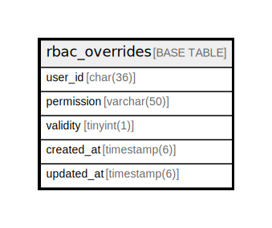

# rbac_overrides

## Description

<details>
<summary><strong>Table Definition</strong></summary>

```sql
CREATE TABLE `rbac_overrides` (
  `user_id` char(36) NOT NULL DEFAULT '',
  `permission` varchar(50) NOT NULL DEFAULT '',
  `validity` tinyint(1) DEFAULT NULL,
  `created_at` timestamp(6) NULL DEFAULT NULL,
  `updated_at` timestamp(6) NULL DEFAULT NULL,
  PRIMARY KEY (`user_id`,`permission`)
) ENGINE=InnoDB DEFAULT CHARSET=utf8mb4
```

</details>

## Columns

| Name | Type | Default | Nullable | Children | Parents | Comment |
| ---- | ---- | ------- | -------- | -------- | ------- | ------- |
| user_id | char(36) |  | false |  |  |  |
| permission | varchar(50) |  | false |  |  |  |
| validity | tinyint(1) |  | true |  |  |  |
| created_at | timestamp(6) |  | true |  |  |  |
| updated_at | timestamp(6) |  | true |  |  |  |

## Constraints

| Name | Type | Definition |
| ---- | ---- | ---------- |
| PRIMARY | PRIMARY KEY | PRIMARY KEY (user_id, permission) |

## Indexes

| Name | Definition |
| ---- | ---------- |
| PRIMARY | PRIMARY KEY (user_id, permission) USING BTREE |

## Relations



---

> Generated by [tbls](https://github.com/k1LoW/tbls)
