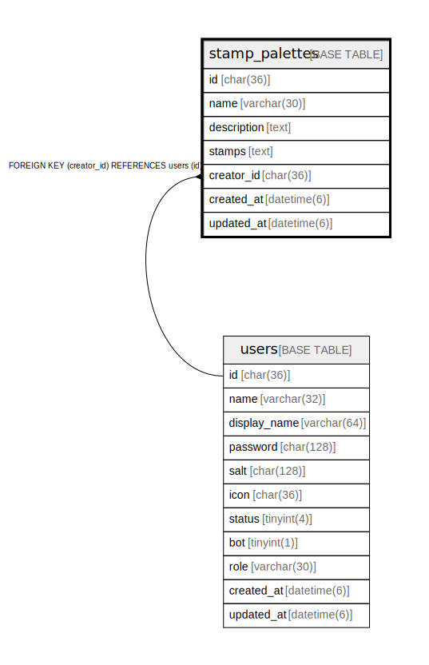

# stamp_palettes

## Description

スタンプパレットテーブル

<details>
<summary><strong>Table Definition</strong></summary>

```sql
CREATE TABLE `stamp_palettes` (
  `id` char(36) NOT NULL,
  `name` varchar(30) NOT NULL,
  `description` text NOT NULL,
  `stamps` text NOT NULL,
  `creator_id` char(36) NOT NULL,
  `created_at` datetime(6) DEFAULT NULL,
  `updated_at` datetime(6) DEFAULT NULL,
  PRIMARY KEY (`id`),
  KEY `idx_stamp_palettes_creator_id` (`creator_id`),
  CONSTRAINT `stamp_palettes_creator_id_users_id_foreign` FOREIGN KEY (`creator_id`) REFERENCES `users` (`id`) ON DELETE CASCADE ON UPDATE CASCADE
) ENGINE=InnoDB DEFAULT CHARSET=utf8mb4
```

</details>

## Columns

| Name | Type | Default | Nullable | Children | Parents | Comment |
| ---- | ---- | ------- | -------- | -------- | ------- | ------- |
| id | char(36) |  | false |  |  | スタンプパレットUUID |
| name | varchar(30) |  | false |  |  | スタンプパレット名 |
| description | text |  | false |  |  | スタンプパレットの説明 |
| stamps | text |  | false |  |  | スタンプUUID配列の文字列 |
| creator_id | char(36) |  | false |  | [users](users.md) | 作成者UUID |
| created_at | datetime(6) | NULL | true |  |  | 作成日時 |
| updated_at | datetime(6) | NULL | true |  |  | 更新日時 |

## Constraints

| Name | Type | Definition |
| ---- | ---- | ---------- |
| PRIMARY | PRIMARY KEY | PRIMARY KEY (id) |
| stamp_palettes_creator_id_users_id_foreign | FOREIGN KEY | FOREIGN KEY (creator_id) REFERENCES users (id) |

## Indexes

| Name | Definition |
| ---- | ---------- |
| idx_stamp_palettes_creator_id | KEY idx_stamp_palettes_creator_id (creator_id) USING BTREE |
| PRIMARY | PRIMARY KEY (id) USING BTREE |

## Relations



---

> Generated by [tbls](https://github.com/k1LoW/tbls)
