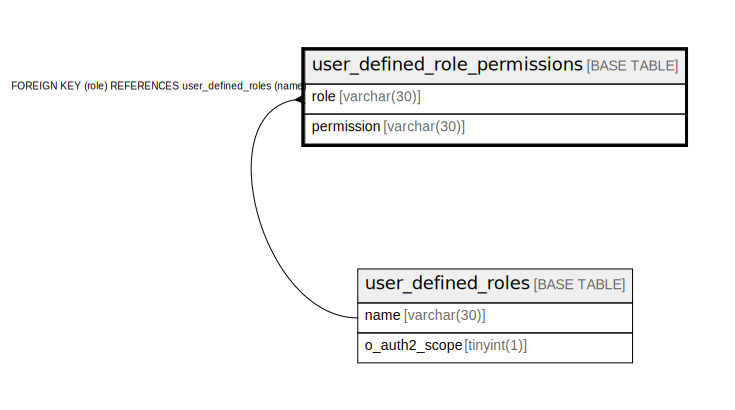

# user_defined_role_permissions

## Description

<details>
<summary><strong>Table Definition</strong></summary>

```sql
CREATE TABLE `user_defined_role_permissions` (
  `role` varchar(30) NOT NULL,
  `permission` varchar(30) NOT NULL,
  PRIMARY KEY (`role`,`permission`),
  CONSTRAINT `user_defined_roles_name_583119bc40d20976de99ef781e2ba297d3b0e18f` FOREIGN KEY (`role`) REFERENCES `user_defined_roles` (`name`) ON DELETE CASCADE ON UPDATE CASCADE
) ENGINE=InnoDB DEFAULT CHARSET=utf8mb4
```

</details>

## Columns

| Name | Type | Default | Nullable | Children | Parents | Comment |
| ---- | ---- | ------- | -------- | -------- | ------- | ------- |
| role | varchar(30) |  | false |  | [user_defined_roles](user_defined_roles.md) |  |
| permission | varchar(30) |  | false |  |  |  |

## Constraints

| Name | Type | Definition |
| ---- | ---- | ---------- |
| PRIMARY | PRIMARY KEY | PRIMARY KEY (role, permission) |
| user_defined_roles_name_583119bc40d20976de99ef781e2ba297d3b0e18f | FOREIGN KEY | FOREIGN KEY (role) REFERENCES user_defined_roles (name) |

## Indexes

| Name | Definition |
| ---- | ---------- |
| PRIMARY | PRIMARY KEY (role, permission) USING BTREE |

## Relations



---

> Generated by [tbls](https://github.com/k1LoW/tbls)
