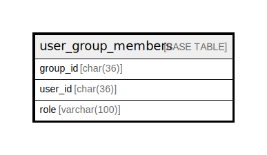

# user_group_members

## Description

ユーザーグループメンバーテーブル

<details>
<summary><strong>Table Definition</strong></summary>

```sql
CREATE TABLE `user_group_members` (
  `group_id` char(36) NOT NULL,
  `user_id` char(36) NOT NULL,
  `role` varchar(100) NOT NULL DEFAULT '',
  PRIMARY KEY (`group_id`,`user_id`),
  CONSTRAINT `user_group_members_group_id_user_groups_id_foreign` FOREIGN KEY (`group_id`) REFERENCES `user_groups` (`id`) ON DELETE CASCADE ON UPDATE CASCADE
) ENGINE=InnoDB DEFAULT CHARSET=utf8mb4
```

</details>

## Columns

| Name | Type | Default | Nullable | Children | Parents | Comment |
| ---- | ---- | ------- | -------- | -------- | ------- | ------- |
| group_id | char(36) |  | false |  | [user_groups](user_groups.md) | グループUUID |
| user_id | char(36) |  | false |  |  | ユーザーUUID |
| role | varchar(100) |  | false |  |  | 役割 |

## Constraints

| Name | Type | Definition |
| ---- | ---- | ---------- |
| PRIMARY | PRIMARY KEY | PRIMARY KEY (group_id, user_id) |
| user_group_members_group_id_user_groups_id_foreign | FOREIGN KEY | FOREIGN KEY (group_id) REFERENCES user_groups (id) |

## Indexes

| Name | Definition |
| ---- | ---------- |
| PRIMARY | PRIMARY KEY (group_id, user_id) USING BTREE |

## Relations



---

> Generated by [tbls](https://github.com/k1LoW/tbls)
