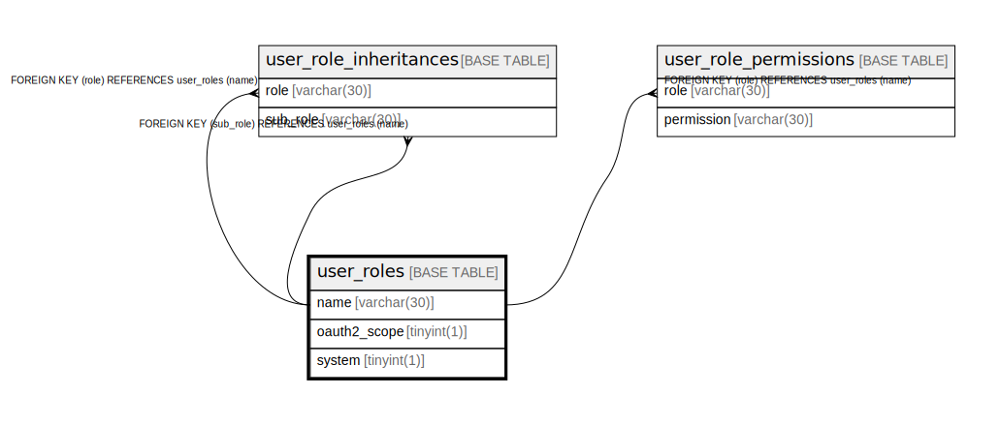

# user_roles

## Description

<details>
<summary><strong>Table Definition</strong></summary>

```sql
CREATE TABLE `user_roles` (
  `name` varchar(30) NOT NULL,
  `oauth2_scope` tinyint(1) NOT NULL DEFAULT '0',
  `system` tinyint(1) NOT NULL DEFAULT '0',
  PRIMARY KEY (`name`)
) ENGINE=InnoDB DEFAULT CHARSET=utf8mb4
```

</details>

## Columns

| Name | Type | Default | Nullable | Children | Parents | Comment |
| ---- | ---- | ------- | -------- | -------- | ------- | ------- |
| name | varchar(30) |  | false | [user_role_inheritances](user_role_inheritances.md) [user_role_inheritances](user_role_inheritances.md) [user_role_permissions](user_role_permissions.md) |  |  |
| oauth2_scope | tinyint(1) | 0 | false |  |  |  |
| system | tinyint(1) | 0 | false |  |  |  |

## Constraints

| Name | Type | Definition |
| ---- | ---- | ---------- |
| PRIMARY | PRIMARY KEY | PRIMARY KEY (name) |

## Indexes

| Name | Definition |
| ---- | ---------- |
| PRIMARY | PRIMARY KEY (name) USING BTREE |

## Relations



---

> Generated by [tbls](https://github.com/k1LoW/tbls)
