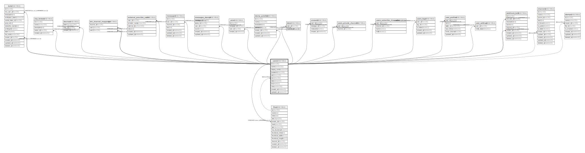

# users

## Description

<details>
<summary><strong>Table Definition</strong></summary>

```sql
CREATE TABLE `users` (
  `id` char(36) NOT NULL,
  `name` varchar(32) NOT NULL,
  `display_name` varchar(64) NOT NULL DEFAULT '',
  `password` char(128) NOT NULL DEFAULT '',
  `salt` char(128) NOT NULL DEFAULT '',
  `icon` char(36) NOT NULL,
  `status` tinyint(4) NOT NULL DEFAULT '0',
  `bot` tinyint(1) NOT NULL DEFAULT '0',
  `role` varchar(30) NOT NULL DEFAULT 'user',
  `twitter_id` varchar(15) NOT NULL DEFAULT '',
  `last_online` timestamp(6) NULL DEFAULT NULL,
  `created_at` timestamp(6) NULL DEFAULT NULL,
  `updated_at` timestamp(6) NULL DEFAULT NULL,
  PRIMARY KEY (`id`),
  UNIQUE KEY `name` (`name`)
) ENGINE=InnoDB DEFAULT CHARSET=utf8mb4
```

</details>

## Columns

| Name | Type | Default | Nullable | Children | Parents | Comment |
| ---- | ---- | ------- | -------- | -------- | ------- | ------- |
| id | char(36) |  | false | [clip_folders](clip_folders.md) [clips](clips.md) [devices](devices.md) [messages](messages.md) [messages_stamps](messages_stamps.md) [mutes](mutes.md) [pins](pins.md) [stars](stars.md) [unreads](unreads.md) [users_private_channels](users_private_channels.md) [users_subscribe_channels](users_subscribe_channels.md) [users_tags](users_tags.md) |  |  |
| name | varchar(32) |  | false |  |  |  |
| display_name | varchar(64) |  | false |  |  |  |
| password | char(128) |  | false |  |  |  |
| salt | char(128) |  | false |  |  |  |
| icon | char(36) |  | false |  |  |  |
| status | tinyint(4) | 0 | false |  |  |  |
| bot | tinyint(1) | 0 | false |  |  |  |
| role | varchar(30) | user | false |  |  |  |
| twitter_id | varchar(15) |  | false |  |  |  |
| last_online | timestamp(6) |  | true |  |  |  |
| created_at | timestamp(6) |  | true |  |  |  |
| updated_at | timestamp(6) |  | true |  |  |  |

## Constraints

| Name | Type | Definition |
| ---- | ---- | ---------- |
| name | UNIQUE | UNIQUE KEY name (name) |
| PRIMARY | PRIMARY KEY | PRIMARY KEY (id) |

## Indexes

| Name | Definition |
| ---- | ---------- |
| PRIMARY | PRIMARY KEY (id) USING BTREE |
| name | UNIQUE KEY name (name) USING BTREE |

## Relations



---

> Generated by [tbls](https://github.com/k1LoW/tbls)
